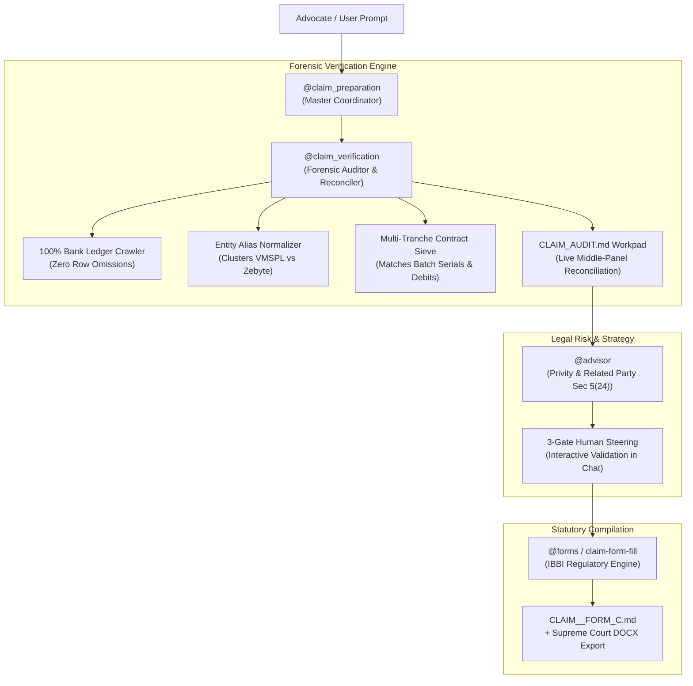

# 📖 Complete User Guide: Forensic Claims Agents Suite (`@claim_preparation` & `@claim_verification`)

> **Hayagriva Legal Intelligence Platform**  
> *Statutory Proof of Claim Preparation, Forensic Bank Ledger Reconciliation & IBC Compliance Engine*

---

## 1. What Are the Claims Agents?

The **Hayagriva Claims Agent Suite** is an autonomous, multi-agent legal engine designed specifically for Advocates, Resolution Professionals (IRPs/RPs), and Financial Creditors under the **Insolvency and Bankruptcy Code, 2016 (IBC)**.

Unlike naive text generators that blindly copy-paste text into forms, Hayagriva uses a **4-Tier Forensic Architecture**:



---

## 2. When & Where to Use Which Agent?

| Agent Tag | Primary Role | When to Use | Typical Prompt |
| :--- | :--- | :--- | :--- |
| **`@claim_preparation`** | **Master Claim Builder & Drafter** | Use when preparing a new proof of claim from scratch using client documents (bank statements, purchase agreements, leases). | `@claim_preparation prepare claim for Savita Mittal` |
| **`@claim_verification`** | **Forensic Auditor & Math Reconciler** | Use when scrutinizing an already filed claim, auditing bank ledger rows, or verifying limitation under Section 238A. | `@claim_verification audit ledger and calculate unrecovered principal` |
| **`@claims`** | **Portfolio & Registry Tracker** | Use to view all filed claims across a Corporate Debtor and update `claims_registry.md`. | `@claims list all admitted financial claims` |

---

## 3. The 3-Surface Transparency Model (Where Information Appears)

To eliminate black-box uncertainty, the claims engine outputs information across **three coordinated surfaces**:

```
┌────────────────────────────────────────────────────────────────────────────────────────┐
│                                 HAYAGRIVA WORKSPACE                                    │
│                                                                                        │
│  ┌───────────────────────┐  ┌───────────────────────────────┐  ┌────────────────────┐  │
│  │     LEFT PANEL        │  │         MIDDLE PANEL          │  │    RIGHT PANEL     │  │
│  │   Explorer & Tree     │  │  Live Claim Audit Workpad     │  │   Interactive Chat │  │
│  │                       │  │     (CLAIM_AUDIT.md)          │  │     (@claim_prep)  │  │
│  │ 📁 Case Folder        │  │                               │  │                    │  │
│  │  📄 Bank Statement   │  │ 🔍 Entity Cluster Matrix       │  │ 💭 Thinking Stream │  │
│  │  📄 ASA Agreement     │  │ 📊 Reconciled Ledger Table     │  │ 📋 Process Logs    │  │
│  │  📄 AMPA Agreement    │  │ ⚠️ Ambiguity & Red Flag Radar  │  │ 🛑 Checkpoint Gate │  │
│  │  📝 CLAIM_AUDIT.md ───┼──► [Clickable source references] │  │  (Approve/Redirect)│  │
│  └───────────────────────┘  └───────────────────────────────┘  └────────────────────┘  │
└────────────────────────────────────────────────────────────────────────────────────────┘
```

1. **Surface 1: Collapsible Thinking Stream (Chat):**  
   Click `<details><summary>🔍 Forensic Verification Stream</summary></details>` to inspect every bank row parsed, debit matched, and entity alias resolved in real time.
2. **Surface 2: Live Middle-Panel Workpad (`CLAIM_AUDIT.md`):**  
   A live Markdown sheet generated directly in the client folder detailing:
   * The Red-Flag / Anomaly Register.
   * Full 100% Reconciled Bank Statement Ledger (Outflows vs. Inflows).
   * Exact Cloud Particle Serial Numbers.
3. **Surface 3: The 3 Interactive Checkpoint Gates:**  
   Before any court document is drafted, the agent pauses and asks you to confirm:
   * **Checkpoint 1:** Particle Batches and Invoiced Amounts.
   * **Checkpoint 2:** Total Inflow, Total Outflow, and Default Commencement Date.
   * **Checkpoint 3:** Strategic Pleading Choice (Direct vs. Composite Claim).

---

## 4. Supported Statutory IBBI Claim Forms

The agent supports all standardized IBBI proof of claim templates:

| Statutory Form | Creditor Category | Governing Regulation | Typical Documents Needed |
| :--- | :--- | :--- | :--- |
| **`FORM C`** | **Financial Creditors** | Regulation 8 | Bank Statements, Loan Agreements, Sale & Leaseback Contracts, Sanction Letters. |
| **`FORM CA`** | **Creditors in a Class** (e.g. Homebuyers / Allottees) | Regulation 8A | Builder-Buyer Agreements (BBA), Allotment Letters, Payment Receipts. |
| **`FORM B`** | **Operational Creditors** (Suppliers, Landlords) | Regulation 7 | Unpaid Invoices, Purchase Orders, Delivery Challans, Demand Notices (Form 3/4). |
| **`FORM D`** | **Workmen & Employees** | Regulation 9 | Employment Contracts, Salary Slips, PF / Gratuity Records. |
| **`FORM F`** | **Other Creditors** | Regulation 9A | Statutory dues, indemnities, unclassified obligations. |

---

## 5. How to Run the Agent (Step-by-Step)

### Scenario A: Working Inside a Single Client Folder

1. **Step 1: Place Client Documents:**  
   Drop all available PDFs (Bank Statements, Asset Sale Agreements, SLAs, Lease Agreements) into the client’s case directory.
2. **Step 2: Start Pre-Flight Audit:**  
   In the Chat box, type:
   ```text
   @claim_preparation prepare claim
   ```
3. **Step 3: Review the 3-Surface Audit:**  
   * Expand the thought stream in chat.
   * Review `CLAIM_AUDIT.md` in the Middle Panel.
   * Confirm the numbers at Checkpoints 1 & 2.
4. **Step 4: Execute Drafting:**  
   Reply with:
   ```text
   Draft Composite Claim
   ```
   *The finalized `CLAIM_<NAME>_FORM_C.md` will be placed in the case folder.*

---

### Scenario B: Batch Processing Multiple Client Folders

If you have a master folder containing dozens of claimant directories (e.g. `/Users/atulgrover/Desktop/Clients/`):

1. **Run the Batch Command:**
   ```text
   @claim_preparation batch process all claimant folders in /Users/atulgrover/Desktop/Clients
   ```
2. **Automatic Idempotency (Safe Skip):**
   * The agent will scan all folders.
   * Any client folder that **already has a generated claim form is automatically skipped** to protect existing manual edits.
   * Folders without claim forms are processed independently.
3. **Master Summary Table:**
   The agent outputs a centralized table showing the status, particle count, capital invested, and clickable links to every client's Form C.

---

## 6. Multi-Party Schemes & 10-Year Lock-In Damages

### Handling Split-Entity Flows (e.g., Vuenow vs. Zebyte)
In multi-party Sale-and-Leaseback schemes where **Entity A received the deposit** and **Entity B is the Corporate Debtor in CIRP**:
1. **Section 5(24) Related Party Pleading:**  
   The agent automatically constructs a specialized brief in **Form C Box 8** citing common platform (`mycloudparticles.com`), contract recitals (Recital B of AMPA), and *State Bank of India v. Videocon Industries Ltd.* to establish a **Single Economic Enterprise**.
2. **10-Year Lock-In Damages (96 Unexpired Months = ₹51.41 Lakhs):**  
   Under Clause 7 of the ASA and Clause 4 of the SLA, contracts mandate a non-terminable 10-year lock-in. The agent claims:
   * **Tier 1 (Principal Consideration):** Full initial capital (e.g. ₹14.17 Lakhs).
   * **Tier 2 (Unexpired Bargain Loss):** Remaining 96 months $\times$ ₹53,550/mo = **₹51,40,800.00** in Box 8 & **Annexure D**.

---

## 7. Command Reference & Flags

```
┌────────────────────────────────────────────────────────────────────────────────────────┐
│                              COMMAND & FLAG REFERENCE                                  │
└────────────────────────────────────────────────────────────────────────────────────────┘
```

### A. Core Execution Commands

| Action | Prompt Syntax |
| :--- | :--- |
| **Interactive Pre-Flight Audit** | `@claim_preparation prepare claim` |
| **Direct Composite Claim (Full Recovery)** | `@claim_preparation draft composite claim` |
| **Direct Rental Arrears Claim (Conservative)** | `@claim_preparation draft direct rental claim` |
| **Target Specific Form (e.g., Homebuyer)** | `@claim_preparation draft Form CA for [Name]` |
| **Target Operational Form (e.g., Supplier)** | `@claim_preparation draft Form B for [Name]` |

---

### B. Command Flags & Modifiers

You can append explicit flags to your prompt to control agent behavior:

#### 1. `--force` / `force` / `regenerate` *(Batch Overwrite Override)*
* **Default Behavior:** By default, batch processing skips any folder that already has a `CLAIM_*_FORM_*.md` file.
* **With Flag:** Forces the agent to re-crawl bank statements, re-audit contracts, and overwrite existing claim forms from scratch across all folders.
* **Usage:**
  ```text
  @claim_preparation batch process all folders in /Users/atulgrover/Desktop/Clients --force
  ```
  *or:*
  ```text
  @claim_preparation batch process all claimants force
  ```

---

#### 2. `pathway composite` vs `pathway direct` *(Strategy Selector)*
* **`composite` (Default):** Claims full capital deposit + 10-year lock-in contractual damages + Section 5(24) single economic unit brief.
* **`direct`:** Restricts the claim strictly to defaulted monthly rental arrears from the date of default up to ICD.
* **Usage:**
  ```text
  @claim_preparation draft claim pathway direct
  ```
  ```text
  @claim_preparation draft claim pathway composite
  ```

---

#### 3. Custom Number & Date Overrides
You can manually inject specific principal amounts or default dates in natural language:
```text
@claim_preparation draft Form C with principal Rs. 14,17,487 and default date 2024-11-01
```

---

## 8. Troubleshooting & Frequently Asked Questions (FAQ)

### Q1: What if a bank statement is 50+ pages long? Will the agent miss rows?
> **Answer:** No. The `@claim_verification` skill uses an exhaustive, line-by-line DOM table crawler (`auditBankLedger`) that parses 100% of all debit and credit rows without LLM sampling or text truncation.

### Q2: Why is the claim placed in both the case root and `02_claims/`?
> **Answer:** For maximum convenience:
> * **Case Root (`CLAIM_<NAME>_FORM_C.md`):** Sits directly alongside your primary PDFs for immediate visibility.
> * **Archive Folder (`02_claims/`):** Preserves the formal regulatory filing structure for CIRP data rooms.

### Q3: How do I print or export the generated Form C for court submission?
> **Answer:** Right-click `CLAIM_<NAME>_FORM_C.md` in the File Explorer and select:
> * **⚡ Export Supreme Court DOCX** (formats margins, Times New Roman 14pt, 1.5 line spacing conforming to NCLT / Supreme Court rules).
