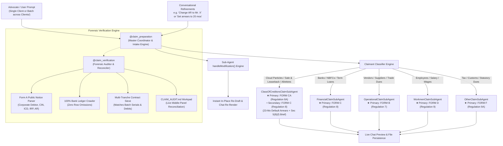

# 📖 Complete User Guide: Forensic Claims Agents Suite (`@claim_preparation` & `@claim_verification`)

> **Hayagriva Legal Intelligence Platform**  
> *Autonomous Multi-Class Proof of Claim Preparation, Forensic Bank Ledger Reconciliation & IBBI Statutory Compliance Engine*

---

## 1. What Are the Claims Agents?

The **Hayagriva Claims Agent Suite** is an autonomous, multi-agent legal engine designed specifically for Advocates, Resolution Professionals (IRPs/RPs), and Financial/Operational Creditors under the **Insolvency and Bankruptcy Code, 2016 (IBC)** and **IBBI (Insolvency Resolution Process for Corporate Persons) Regulations, 2016**.

Rather than relying on generic text templates or manual data entry, Hayagriva uses a **Modular Multi-Class Sub-Agent & 4-Tier Forensic Architecture**:



---

## 2. When & Where to Use Which Agent?

| Agent Tag | Primary Role | When to Use | Typical Prompt |
| :--- | :--- | :--- | :--- |
| **`@claim_preparation`** | **Master Intake Coordinator & Multi-Class Sub-Agent Dispatcher** | Use when preparing a new proof of claim from scratch using client documents (bank statements, purchase agreements, leases, public announcements). Auto-dispatches to specialized sub-agents. | `@claim_preparation prepare claim for Savita Mittal` |
| **`@claim_verification`** | **Forensic Auditor & Math Reconciler** | Use when scrutinizing an already filed claim, auditing bank ledger rows, checking limitation under Section 238A, or verifying charge registration (Form CHG-1). | `@claim_verification audit ledger and calculate unrecovered principal` |
| **`@claims`** | **Portfolio & Registry Tracker** | Use to view all filed claims across a Corporate Debtor and update `claims_registry.md`. | `@claims list all admitted financial claims` |

---

## 3. Specialized Multi-Class Sub-Agents & Form Hierarchy

The coordinator automatically identifies the claimant category from files in the case workspace or from natural language prompts, routing execution to dedicated sub-agents:

### A. Class of Creditors Sub-Agent (`ClassOfCreditorsClaimSubAgent`)
* **Target Categories:** Cloud Particle Owners, Assured Return Sale-and-Leaseback investors, Real Estate Allottees, Homebuyers, Retail Debenture Holders.
* **Document Hierarchy:**
  * **★ Primary Statutory Document:** `CLAIM_<NAME>_FORM_CA.md` (*Regulation 8A*) with official Authorized Representative (AR) nomination.
  * **• Secondary Supporting Document:** `CLAIM_<NAME>_FORM_C.md` (*Regulation 8*) safeguarding standard financial debt standing.
* **Mathematical Calculation Engine:**
  * **Principal Investment Consideration:** Reconciles 100% of capital debits across tranches (e.g. 41 Particles = ₹14,17,487.00).
  * **Prior Realized Returns:** Sums all historic credits received (e.g. 24 payments up to 01-Oct-2024 = ₹10,90,710.47).
  * **Contractual Default Arrears:** Accrues defaulted monthly payments from last payment to Insolvency Commencement Date ($23 \text{ months} \times ₹56,103 = \mathbf{₹12,90,369.00}$).
  * **Total Admissible Claim:** $\mathbf{₹14,17,487.00} + \mathbf{₹12,90,369.00} = \mathbf{₹27,07,856.00}$.
* **Specialized Legal Pleadings (Annexure E):**
  * Invokes Section 5(8)(f) (*Pioneer Urban Land & Infrastructure Ltd. v. UOI*) establishing commercial effect of a borrowing.
  * Paginates Section 5(24) Single Economic Enterprise connectedness between marketing/deposit entities (Vuenow) and lessee corporate debtors (Zebyte).

### B. Financial Creditors Sub-Agent (`FinancialClaimSubAgent`)
* **Target Categories:** Commercial Banks, NBFCs, Institutional Lenders, Inter-Corporate Loans.
* **Primary Form:** `CLAIM_<NAME>_FORM_C.md` (*Regulation 8*).
* **Particulars:** Disbursed facilities, contractual & penal interest calculations, ROC Charge Form CHG-1 registration numbers, and NeSL Record of Default.

### C. Operational Creditors Sub-Agent (`OperationalClaimSubAgent`)
* **Target Categories:** Vendors, Suppliers, Contractors, Landlords, Service Providers.
* **Primary Form:** `CLAIM_<NAME>_FORM_B.md` (*Regulation 7*).
* **Particulars:** Itemized unpaid invoices, purchase orders, delivery challans, and Section 8 Form 3/4 demand notices.

### D. Workmen & Employees Sub-Agent (`WorkmenClaimSubAgent`)
* **Target Categories:** Factory Workmen, Corporate Employees, Staff.
* **Primary Form:** `CLAIM_<NAME>_FORM_D.md` (*Regulation 9*).
* **Particulars:** Unpaid salary arrears, bonus, gratuity, provident fund, and Section 53(1)(b) 24-month priority ranking.

### E. Other Creditors Sub-Agent (`OtherClaimSubAgent`)
* **Target Categories:** Municipal authorities, State/Central Tax Departments (GST/Income Tax), Customs, Statutory Dues.
* **Primary Form:** `CLAIM_<NAME>_FORM_F.md` (*Regulation 9A*).

---

## 4. The 3-Surface Transparency Model

```
┌────────────────────────────────────────────────────────────────────────────────────────┐
│                                 HAYAGRIVA WORKSPACE                                    │
│                                                                                        │
│  ┌───────────────────────┐  ┌───────────────────────────────┐  ┌────────────────────┐  │
│  │     LEFT PANEL        │  │         MIDDLE PANEL          │  │    RIGHT PANEL     │  │
│  │   Explorer & Tree     │  │  Live Claim Audit Workpad     │  │   Interactive Chat │  │
│  │                       │  │     (CLAIM_AUDIT.md)          │  │     (@claim_prep)  │  │
│  │ 📁 Case Folder        │  │                               │  │                    │  │
│  │  📄 Form A Public Ann.│  │ 🔍 Entity Cluster Matrix       │  │ 💭 Thinking Stream │  │
│  │  📄 Bank Statement    │  │ 📊 Reconciled Ledger Table     │  │ 💰 Financial Math  │  │
│  │  📄 ASA / SLA Contracts│ │ ⚠️ Ambiguity & Red Flag Radar  │  │ 🛑 3 Checkpoints   │  │
│  │  📄 AMPA Lease        │  │ 🎯 Crystallized Claim Summary  │  │ 📄 Form CA & Form C│  │
│  │  📝 CLAIM_AUDIT.md ───┼──► [Clickable source references] │  │ 💬 Refinement Gate │  │
│  └───────────────────────┘  └───────────────────────────────┘  └────────────────────┘  │
└────────────────────────────────────────────────────────────────────────────────────────┘
```

1. **Surface 1: Collapsible Thinking Stream (Chat):**  
   Click `<details><summary>🔍 Forensic Verification Stream</summary></details>` to inspect every bank statement row parsed, debit matched, and entity alias resolved in real time.
2. **Surface 2: Live Middle-Panel Workpad (`CLAIM_AUDIT.md`):**  
   A live Markdown sheet generated directly in the client folder detailing:
   * **Forensic Red-Flag & Ambiguity Register** (e.g. Bifurcated Entity Disconnect between Vuenow and Zebyte).
   * **100% Reconciled Bank Statement Ledger** (Capital Outflows vs. Rental Inflows).
   * **Cloud Particle Inventory** (Exact Serial Numbers, FSNs, and Batch counts).
3. **Surface 3: Interactive Refinement & Steering:**  
   Review the financial breakdown and instantly steer details in natural language directly in chat.

---

## 5. Conversational Refinements in Chat

You can conversationally refine any claim parameter at any time! The sub-agent parses natural language modifications, recalculates financial matrices, and updates files on disk:

* **Update Authorized Representative Nominee:**
  ```text
  Change AR to Mr. Rajesh Sharma
  ```
* **Adjust Default Duration or Arrears Calculation:**
  ```text
  Set default arrears to 20 months
  ```
* **Override Principal or Interest:**
  ```text
  Change principal amount to Rs. 14,00,000 and interest to Rs. 50,000
  ```
* **Combined Refinement:**
  ```text
  Change AR to Mr. Harmanjit Singh and set arrears to 23 months
  ```

---

## 6. Batch Processing Across `Clients/` Subfolders

When managing dozens of claimants across folders (e.g., `/Users/atulgrover/Desktop/Clients/`):

1. **Trigger Batch Mode:**
   ```text
   @claim_preparation batch process all claimant folders in /Users/atulgrover/Desktop/Clients
   ```
2. **Autonomous Multi-Client Workflow:**
   * Scans each client subfolder independently.
   * Auto-detects claimant class (Class of Creditors vs. Vendor vs. Bank).
   * Delegates drafting to the matching Sub-Agent.
   * Persists `CLAIM_<NAME>_FORM_CA.md` and `CLAIM_<NAME>_FORM_C.md` in each respective folder.
   * Compiles a centralized master registry: [MASTER_CLAIMS_SUMMARY.md](file:///Users/atulgrover/Desktop/Clients/MASTER_CLAIMS_SUMMARY.md).

---

## 7. Command Reference & Prompts

| Action | Prompt Syntax |
| :--- | :--- |
| **Prepare Full Statutory Package (Single Client)** | `@claim_preparation prepare claim` |
| **Conversational AR Change** | `change AR to Mr. [Name]` |
| **Conversational Arrears Change** | `set arrears to [N] months` |
| **Batch Process All Client Folders** | `@claim_preparation batch process all claimants in [Directory]` |
| **Force Batch Overwrite / Regenerate** | `@claim_preparation batch process all claimants in [Directory] --force` |
| **Audit Claim Limitation & Charge** | `@claim_verification verify claim` |
| **List Portfolio Registry** | `@claims list all claims` |

---

## 8. Exporting for Court & NCLT Filing

Every generated `.md` claim form can be exported to standard Supreme Court / NCLT formatting:
1. Right-click `CLAIM_<NAME>_FORM_CA.md` or `CLAIM_<NAME>_FORM_C.md` in the Explorer.
2. Select **⚡ Export Supreme Court DOCX**.
3. The file is compiled to `.docx` with 4cm left margin, 14pt Times New Roman, 1.5 line spacing, and continuous line numbering ready for print and e-filing.
