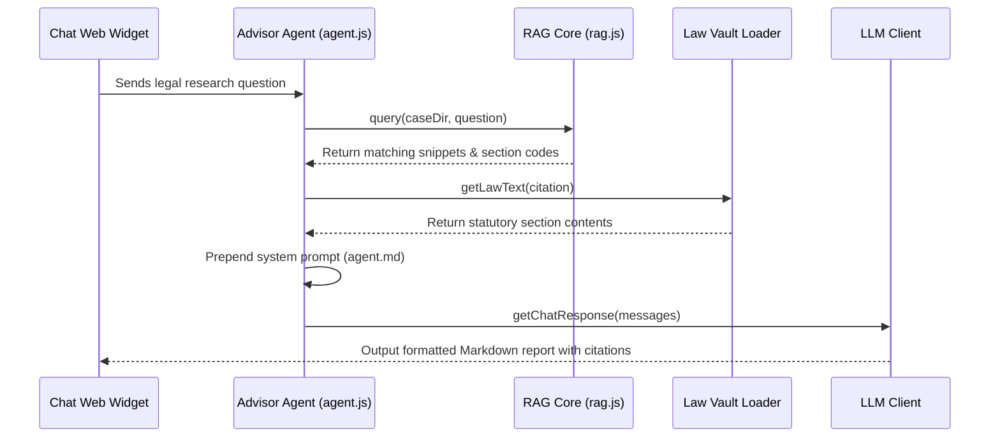

# Advisor Agent - Legal Research & Statutory Q&A

The **Advisor Agent** is the legal research specialist in the Hayagriva workspace, helping professionals consult insolvency codes, regulations, board rules, and appellate precedents.

---

## 1. Context & Information Sources

The Advisor Agent queries the hybrid retrieval system:
1. **Lexical Index:** Search snippets extracted from case documents using SQLite `fts_chunks` (FTS5) and the `bm25_index.json` keyword tables.
2. **Statutory Law Vault:** Integrates with local decrypted legal databases (IBC, MCA rules, regulations) loaded via [vault-loader.js](file:///Users/atulgrover/Desktop/HAYAGRIVA/hayagriva/lib/utils/vault-loader.js).
3. **Precedent Database:** Fetches Supreme Court and NCLAT precedent summaries to map legal assertions to their active judicial stand.

---

## 2. Program Execution Flow

The sequence of data flow for research queries:

---

## 3. Inputs & Outputs

### Core Inputs:
* User legal questions (e.g. *"What is the notice period for an AGM under Section 101?"*).
* Chronological case documents (scanned orders, board minutes).
* Statutory citations matched via `@` and `@@` triggers.

### Core Outputs:
* **Legal Research Report:** Markdown report detailing applicable sections, precedents, and compliance guidelines.
* **Citations Index:** Clickable links referencing sections in the active Law Vault.
