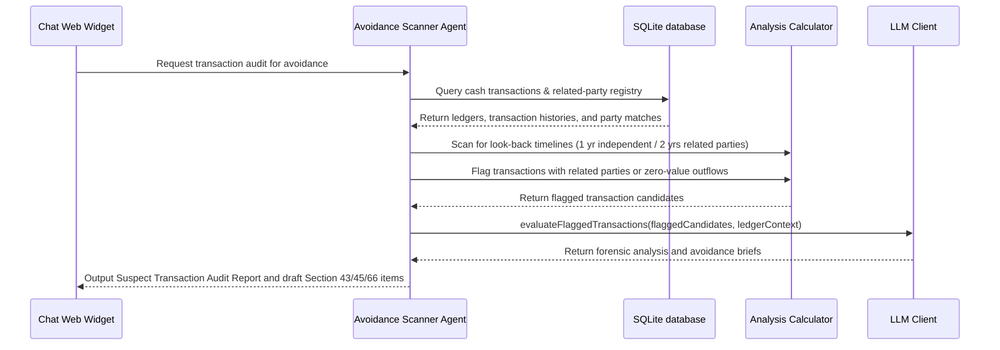

# Avoidance & Forensic Audit Scanner Agent

The **Avoidance & Forensic Audit Scanner Agent** scans ledger transaction records and corporate logs to detect suspicious transactions that could be classified as Preferential (Section 43), Undervalued (Section 45), Extortionate Credit (Section 50), or Fraudulent Trading (Section 66) under the Insolvency and Bankruptcy Code (IBC).

---

## 1. Context & Information Sources

The Avoidance Scanner inspects financial journals, bank accounts, and relationship tables:
1. **Bank Ledgers & Cashbooks:** Structured bank statement entries loaded into the SQLite databases.
2. **Related Party Directories:** Registers of directors, holding/subsidiary companies, and promoter-linked entities.
3. **Valuation Records:** Asset registries and sale invoices showing price parameters.

---

## 2. Program Execution Flow

The sequence of data flow for avoidance scanning:

---

## 3. Avoidance Transaction Categories

* **Preferential (Section 43):** Transfer of property/cash to a creditor during the look-back window that puts them in a better position than they would be under Section 53 waterfall.
* **Undervalued (Section 45):** Assets sold or transferred at a value significantly below the fair liquidation valuation.
* **Extortionate Credit (Section 50):** Debt facilities taken with exorbitant interest rates or unfair credit conditions.
* **Fraudulent/Wrongful Trading (Section 66):** Business carried on with intent to defraud creditors or for any fraudulent purpose.

---

## 4. Inputs & Outputs

### Core Inputs:
* Cash ledger logs.
* Related party registry directories.
* Valuation reports.

### Core Outputs:
* **Forensic Audit Log:** Table list of suspect transaction items (dates, amounts, parties, and IBC code violated).
* **Forensic Avoidance Report:** Markdown summaries detailing the look-back timelines and transactions evidence suitable for NCLT filings.
