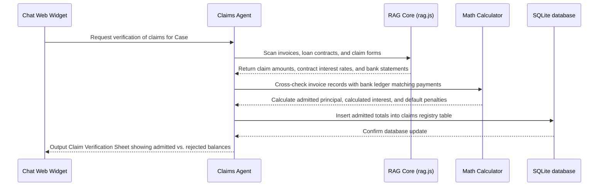

# Claims Verification Agent - Insolvency Claims Auditing

The **Claims Verification Agent** evaluates and audits claims submitted by creditors (Financial, Operational, Employees) during Corporate Insolvency Resolution Processes (CIRP) under the IBC.

---

## 1. Context & Information Sources

The Claims Verification Agent queries multiple financial and legal documents:
1. **Submitted Claim Forms:** Markdown transcriptions of Form B (Operational), Form C (Financial), Form D (Employees).
2. **Supporting Invoices & Ledgers:** Invoices, bank ledger sheets, and corporate transaction logs.
3. **Contracts & Loan Agreements:** Scans loan terms, credit facility contracts, and parses interest rates, default conditions, and penalty clauses.

---

## 2. Program Execution Flow

The sequence of data flow for verifying claims:

---

## 3. Inputs & Outputs

### Core Inputs:
* Scanned claim forms (Form B/C/D) and bank transaction receipts.
* Contract agreements detailing interest rules.

### Core Outputs:
* **Claims Verification Matrix:** A structured breakdown showing:
  * Claimed Amount
  * Admitted Principal
  * Admitted Interest
  * Rejected Amount (with detailed rejection codes/reasons)
* **SQLite Claims Table:** Updated records inside the `claims_registry` SQLite table.
