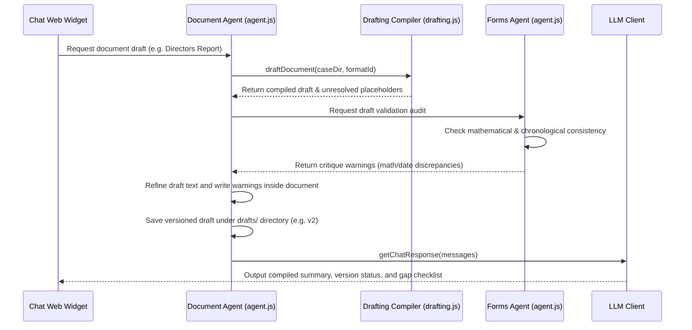

# Document Agent - Legal Drafting Compiler & Critique Loops

The **Document Agent** compiles legal reports, minutes, resolutions, and contract agreements by interpolating case variables into Markdown templates and running self-correction audits.

---

## 1. Context & Information Sources

The Document Agent coordinates with:
1. **Templates Skeletons:** Markdown document structures and prompts under the `templates/` directory.
2. **Case Variables:** Values fetched from `case_kv_dictionary.json` or `case_facts` SQLite database.
3. **Forms Agent Critique:** Automated peer auditing of drafted variables prior to presentation.

---

## 2. Program Execution Flow (The Self-Correction Critique Loop)

The sequence of data flow for document generation:

---

## 3. Inputs & Outputs

### Core Inputs:
* Target template format ID (e.g., `directors-report`).
* Dictionary variables (`case_kv_dictionary.json`).
* Sibling critique results.

### Core Outputs:
* **Compiled Draft:** Versioned Markdown documents (e.g., `directors-report_v2.md`) saved under the `drafts/` case directory.
* **Placeholder Index:** Line-by-line list of unresolved placeholders requiring user input.
