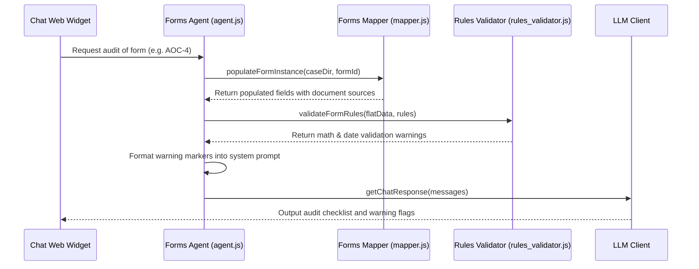

# Forms Agent - Compliance Validation & Math Audits

The **Forms Agent** audits financial figures, compliance metrics, and chronological timelines inside corporate forms (like MCA filing templates, e.g., AOC-4, MGT-7).

---

## 1. Context & Information Sources

The Forms Agent relies on:
1. **Forms Schemas:** Verification rules and data fields stored under `forms/form_id/schema.json`.
2. **Case Dictionary:** Value configurations mapped inside `case_kv_dictionary.json` or `case_facts` SQLite tables.
3. **Source Documents:** Ingested companion Markdown documents containing the original tables/figures.

---

## 2. Program Execution Flow

The sequence of data flow for auditing operations:

---

## 3. Auditing Assertions

* **Equation Validation:** Checks balance logic (e.g., `paid_up_capital + reserves_and_surplus = net_worth`).
* **Chronology Validation:** Checks date hierarchies (e.g., `board_resolution_date <= notice_of_agm_date <= agm_date`).
* **Source Tracking:** Pinpoints exactly which page and document source provided the value.

---

## 4. Inputs & Outputs

### Core Inputs:
* Ingested financial statements (Balance Sheets, P&L accounts).
* Target form compliance rules (`schema.json`).

### Core Outputs:
* **Compliance Warnings:** Error markers logged in the `compliance_alerts` SQLite table.
* **Synchronized Dictionary:** Updated values inside `case_kv_dictionary.json`.
* **Audit Report:** Markdown listing verified constraints and compliance gap alerts.
