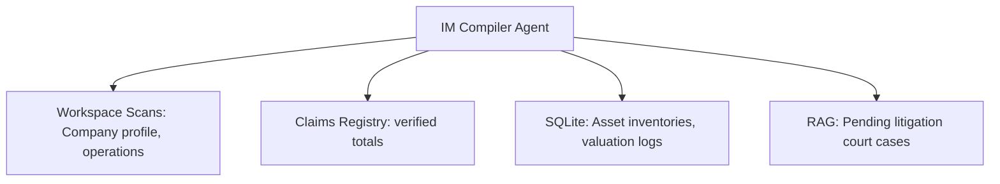
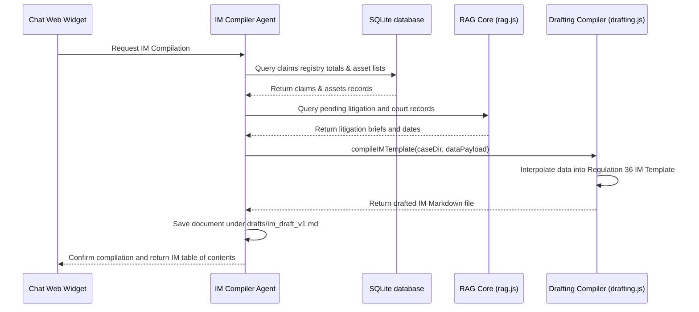

# Information Memorandum (IM) Compiler Agent

The **Information Memorandum (IM) Compiler Agent** aggregates company profiles, financial balance sheets, asset lists, claims registries, and pending litigations to compile the formal Information Memorandum required under Regulation 36 of the CIRP Regulations.

---

## 1. Context & Information Sources

The IM Compiler Agent aggregates information from across the active workspace:

1. **Company Profiles & Operations:** Scans general company descriptions, corporate registrations, and business assets.
2. **Claims Registry:** Pulls admitted and verified claim totals from the SQLite databases.
3. **Asset Valuations:** Extracts asset summaries and liquidation values from valuation spreadsheets.
4. **Litigations:** Queries RAG for pending NCLT and appellate litigation case logs.

---

## 2. Program Execution Flow

The sequence of data flow for IM compilation:

---

## 3. Inputs & Outputs

### Core Inputs:
* Balance sheets, valuation reports, and audit statements.
* Claims registry data.
* List of active lawsuits.

### Core Outputs:
* **Regulation 36 IM Draft:** Structured Markdown document containing:
  * Company Overview & Capital Structure
  * Financial Statements Summary
  * Verified Claims Registry Summary
  * Asset Inventory Schedules
  * Litigation & Statutory Liabilities Log
