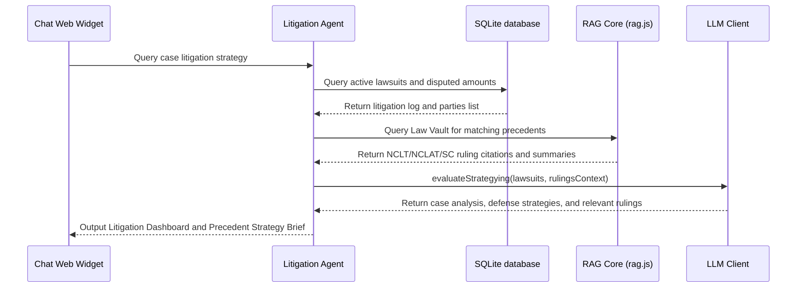

# Litigation Tracker & Case Law Matching Agent

The **Litigation Tracker & Case Law Matching Agent** scans case records for active disputes, matches statutory claims against latest NCLT/NCLAT/Supreme Court precedents in the Law Vault, and drafts case law briefs.

---

## 1. Context & Information Sources

The Litigation Tracker connects case lawsuits with appellate precedents:
1. **Case Litigation List:** Details of pending lawsuits, claims, and appeals involving the Corporate Debtor.
2. **Appellate Precedent Vault:** Local legal databases containing Supreme Court and NCLAT rulings loaded via [vault-loader.js](file:///Users/atulgrover/Desktop/HAYAGRIVA/hayagriva/lib/utils/vault-loader.js).
3. **Court Orders:** Ingested NCLT/NCLAT court order files (processed in Ingestion Step 1).

---

## 2. Program Execution Flow

The sequence of data flow for litigation tracking and precedent matching:

---

## 3. Inputs & Outputs

### Core Inputs:
* Litigation case summaries and court orders.
* Judicial ruling indices in the Law Vault.

### Core Outputs:
* **Litigation Tracker Matrix:** Summary table of pending disputes, dates, courts, and amounts.
* **Precedent Strategy Brief:** Markdown brief detailing relevant precedent case citations, key holdings, and strategic defense recommendations.
