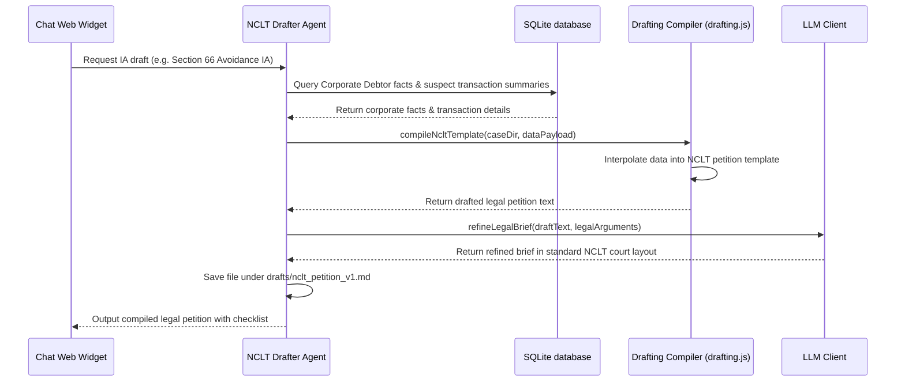

# NCLT Petition Drafter Agent - Court Filings Generation

The **NCLT Petition Drafter Agent** generates formal legal filings, petitions, and Interlocutory Applications (IAs) (e.g., Section 7, 9, 10 insolvency petitions, avoidance transaction applications, and timeline extension applications) for filing before the National Company Law Tribunal (NCLT).

---

## 1. Context & Information Sources

The NCLT Drafter builds legal briefs using case data and legal templates:
1. **NCLT Filing Templates:** Markdown legal skeletons defining the index, synopsis, title board, chronological tables, petition paragraphs, prayers list, and verification affidavits.
2. **Case Fact Dictionary:** Corporate Debtor records, creditor statistics, and insolvency dates.
3. **Evidence Assets:** Forensics audit lists, transaction logs, and claim verify records.

---

## 2. Program Execution Flow

The sequence of data flow for drafting petitions:

---

## 3. Standard Petition Sections

* **Synopsis & List of Dates:** Chronological order of events leading to the filing.
* **Title Board & Parties:** Addresses and descriptions of applicant, respondent, and debtor.
* **Brief Facts:** Explains the grounds of the application and the transactions details.
* **Prayers:** Core legal reliefs requested from the tribunal (e.g., ordering the respondent to pay back undervalued cash).
* **Verification Affidavit:** standard declaration sworn by the Resolution Professional.

---

## 4. Inputs & Outputs

### Core Inputs:
* Ingestion records and transaction evidence logs.
* Legal petition skeletons.

### Core Outputs:
* **Court-Ready Draft:** Formatted Markdown filing documents saved in the `drafts/` case directory.
