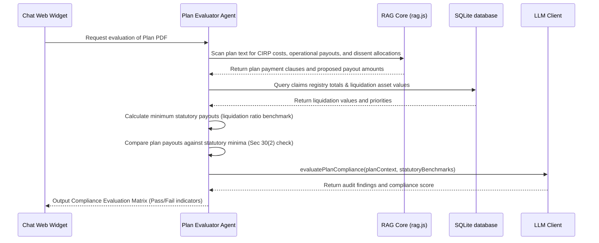

# Resolution Plan Compliance Evaluator Agent

The **Resolution Plan Compliance Evaluator Agent** audits incoming resolution plans submitted by bidders against statutory compliance checklists (specifically Section 30(2) of the IBC) to ensure the plan is legally compliant before submission to the Committee of Creditors (CoC).

---

## 1. Context & Information Sources

The Plan Evaluator connects resolution plan details with insolvency parameters:
1. **Submitted Plan Markdown:** Companion Markdown documents of resolution plan files (processed in Ingestion Step 1).
2. **IBC Section 30(2) Compliance Rules:** Standard statutory requirements defining minimum payout thresholds.
3. **Claims & Valuation Database:** Retrieves total admitted claims and liquidation values to calculate liquidation payouts.

---

## 2. Program Execution Flow

The sequence of data flow for plan evaluation:

---

## 3. Section 30(2) Compliance Checks

* **CIRP Cost Priority:** Checks if the plan provides for payment of insolvency process costs in priority to all other payments.
* **Operational Creditor Payout:** Asserts that operational creditor allocations meet or exceed the liquidation value they would receive under Section 53 waterfall hierarchy.
* **Dissenting Creditor Payout:** Asserts that dissenting financial creditors are allocated payments not less than the liquidation value due to them.
* **Implementation Supervision:** Verifies that a monitoring committee or supervising authority is designated.

---

## 4. Inputs & Outputs

### Core Inputs:
* Submitted resolution plan texts.
* Admitted claims and liquidation values.

### Core Outputs:
* **Section 30(2) Compliance Matrix:** Markdown checklist showing Pass/Fail alerts for each statutory rule.
* **Payment Allocation Summary:** Comparative table of claimed vs. proposed plan payouts.
