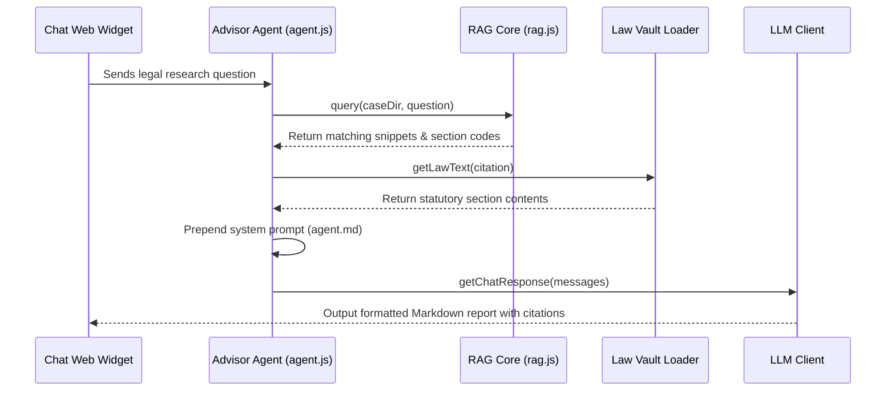
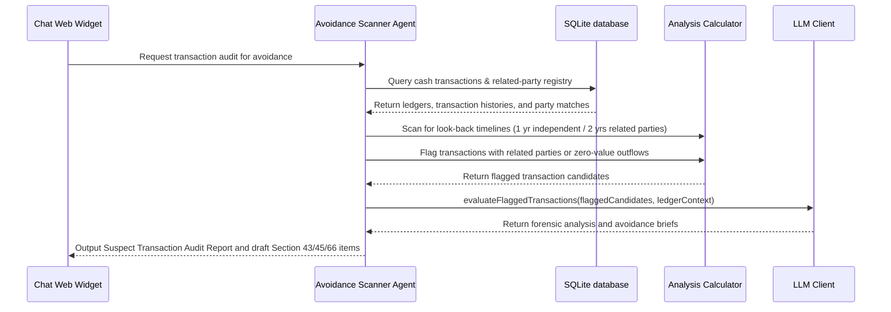
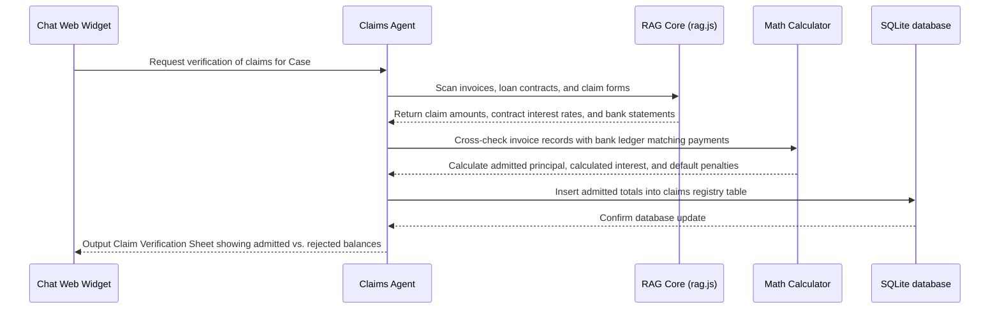
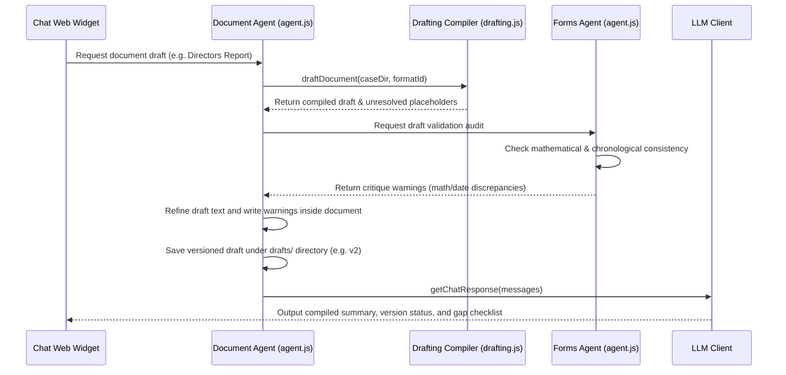
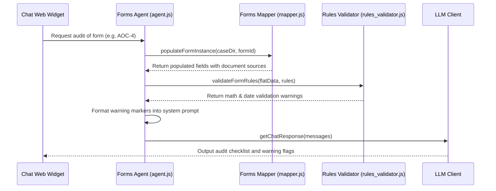
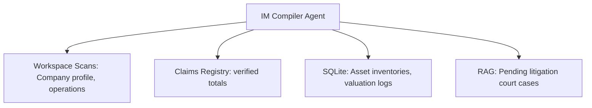
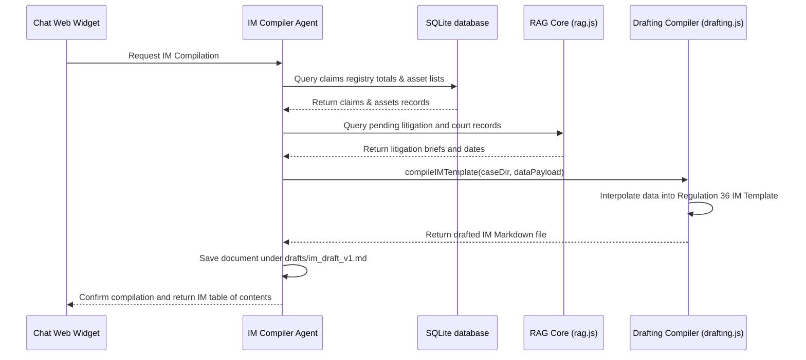
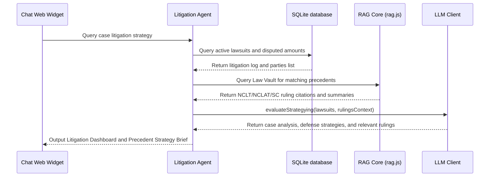
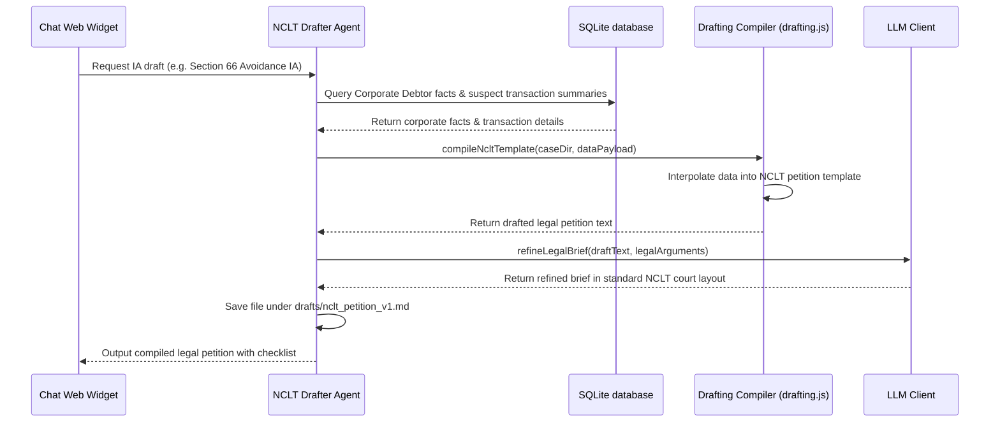
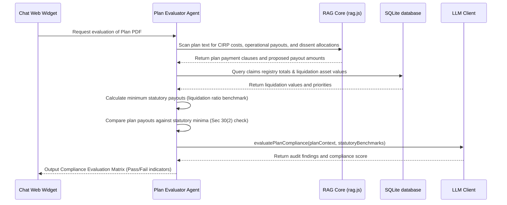

# HAYAGRIVA Cognitive Agents Reference Guide

This guide details the specialized operational parameters, input/output structures, and decision flows for all 9 cognitive agents in the HAYAGRIVA workspace.

---

# Advisor Agent - Legal Research & Statutory Q&A

The **Advisor Agent** is the legal research specialist in the Hayagriva workspace, helping professionals consult insolvency codes, regulations, board rules, and appellate precedents.

---

## 1. Context & Information Sources

The Advisor Agent queries the hybrid retrieval system:
1. **Lexical Index:** Search snippets extracted from case documents using SQLite `fts_chunks` (FTS5) and the `bm25_index.json` keyword tables.
2. **Statutory Law Vault:** Integrates with local decrypted legal databases (IBC, MCA rules, regulations) loaded via [vault-loader.js](file:///Users/atulgrover/Desktop/HAYAGRIVA/hayagriva/lib/utils/vault-loader.js).
3. **Precedent Database:** Fetches Supreme Court and NCLAT precedent summaries to map legal assertions to their active judicial stand.

---

## 2. Program Execution Flow

The sequence of data flow for research queries:

---

## 3. Inputs & Outputs

### Core Inputs:
* User legal questions (e.g. *"What is the notice period for an AGM under Section 101?"*).
* Chronological case documents (scanned orders, board minutes).
* Statutory citations matched via `@` and `@@` triggers.

### Core Outputs:
* **Legal Research Report:** Markdown report detailing applicable sections, precedents, and compliance guidelines.
* **Citations Index:** Clickable links referencing sections in the active Law Vault.

---

# Avoidance & Forensic Audit Scanner Agent

The **Avoidance & Forensic Audit Scanner Agent** scans ledger transaction records and corporate logs to detect suspicious transactions that could be classified as Preferential (Section 43), Undervalued (Section 45), Extortionate Credit (Section 50), or Fraudulent Trading (Section 66) under the Insolvency and Bankruptcy Code (IBC).

---

## 1. Context & Information Sources

The Avoidance Scanner inspects financial journals, bank accounts, and relationship tables:
1. **Bank Ledgers & Cashbooks:** Structured bank statement entries loaded into the SQLite databases.
2. **Related Party Directories:** Registers of directors, holding/subsidiary companies, and promoter-linked entities.
3. **Valuation Records:** Asset registries and sale invoices showing price parameters.

---

## 2. Program Execution Flow

The sequence of data flow for avoidance scanning:

---

## 3. Avoidance Transaction Categories

* **Preferential (Section 43):** Transfer of property/cash to a creditor during the look-back window that puts them in a better position than they would be under Section 53 waterfall.
* **Undervalued (Section 45):** Assets sold or transferred at a value significantly below the fair liquidation valuation.
* **Extortionate Credit (Section 50):** Debt facilities taken with exorbitant interest rates or unfair credit conditions.
* **Fraudulent/Wrongful Trading (Section 66):** Business carried on with intent to defraud creditors or for any fraudulent purpose.

---

## 4. Inputs & Outputs

### Core Inputs:
* Cash ledger logs.
* Related party registry directories.
* Valuation reports.

### Core Outputs:
* **Forensic Audit Log:** Table list of suspect transaction items (dates, amounts, parties, and IBC code violated).
* **Forensic Avoidance Report:** Markdown summaries detailing the look-back timelines and transactions evidence suitable for NCLT filings.

---

# Claims Verification Agent - Insolvency Claims Auditing

The **Claims Verification Agent** evaluates and audits claims submitted by creditors (Financial, Operational, Employees) during Corporate Insolvency Resolution Processes (CIRP) under the IBC.

---

## 1. Context & Information Sources

The Claims Verification Agent queries multiple financial and legal documents:
1. **Submitted Claim Forms:** Markdown transcriptions of Form B (Operational), Form C (Financial), Form D (Employees).
2. **Supporting Invoices & Ledgers:** Invoices, bank ledger sheets, and corporate transaction logs.
3. **Contracts & Loan Agreements:** Scans loan terms, credit facility contracts, and parses interest rates, default conditions, and penalty clauses.

---

## 2. Program Execution Flow

The sequence of data flow for verifying claims:

---

## 3. Inputs & Outputs

### Core Inputs:
* Scanned claim forms (Form B/C/D) and bank transaction receipts.
* Contract agreements detailing interest rules.

### Core Outputs:
* **Claims Verification Matrix:** A structured breakdown showing:
  * Claimed Amount
  * Admitted Principal
  * Admitted Interest
  * Rejected Amount (with detailed rejection codes/reasons)
* **SQLite Claims Table:** Updated records inside the `claims_registry` SQLite table.

---

# Document Agent - Legal Drafting Compiler & Critique Loops

The **Document Agent** compiles legal reports, minutes, resolutions, and contract agreements by interpolating case variables into Markdown templates and running self-correction audits.

---

## 1. Context & Information Sources

The Document Agent coordinates with:
1. **Templates Skeletons:** Markdown document structures and prompts under the `templates/` directory.
2. **Case Variables:** Values fetched from `case_kv_dictionary.json` or `case_facts` SQLite database.
3. **Forms Agent Critique:** Automated peer auditing of drafted variables prior to presentation.

---

## 2. Program Execution Flow (The Self-Correction Critique Loop)

The sequence of data flow for document generation:

---

## 3. Inputs & Outputs

### Core Inputs:
* Target template format ID (e.g., `directors-report`).
* Dictionary variables (`case_kv_dictionary.json`).
* Sibling critique results.

### Core Outputs:
* **Compiled Draft:** Versioned Markdown documents (e.g., `directors-report_v2.md`) saved under the `drafts/` case directory.
* **Placeholder Index:** Line-by-line list of unresolved placeholders requiring user input.

---

# Forms Agent - Compliance Validation & Math Audits

The **Forms Agent** audits financial figures, compliance metrics, and chronological timelines inside corporate forms (like MCA filing templates, e.g., AOC-4, MGT-7).

---

## 1. Context & Information Sources

The Forms Agent relies on:
1. **Forms Schemas:** Verification rules and data fields stored under `forms/form_id/schema.json`.
2. **Case Dictionary:** Value configurations mapped inside `case_kv_dictionary.json` or `case_facts` SQLite tables.
3. **Source Documents:** Ingested companion Markdown documents containing the original tables/figures.

---

## 2. Program Execution Flow

The sequence of data flow for auditing operations:

---

## 3. Auditing Assertions

* **Equation Validation:** Checks balance logic (e.g., `paid_up_capital + reserves_and_surplus = net_worth`).
* **Chronology Validation:** Checks date hierarchies (e.g., `board_resolution_date <= notice_of_agm_date <= agm_date`).
* **Source Tracking:** Pinpoints exactly which page and document source provided the value.

---

## 4. Inputs & Outputs

### Core Inputs:
* Ingested financial statements (Balance Sheets, P&L accounts).
* Target form compliance rules (`schema.json`).

### Core Outputs:
* **Compliance Warnings:** Error markers logged in the `compliance_alerts` SQLite table.
* **Synchronized Dictionary:** Updated values inside `case_kv_dictionary.json`.
* **Audit Report:** Markdown listing verified constraints and compliance gap alerts.

---

# Information Memorandum (IM) Compiler Agent

The **Information Memorandum (IM) Compiler Agent** aggregates company profiles, financial balance sheets, asset lists, claims registries, and pending litigations to compile the formal Information Memorandum required under Regulation 36 of the CIRP Regulations.

---

## 1. Context & Information Sources

The IM Compiler Agent aggregates information from across the active workspace:

1. **Company Profiles & Operations:** Scans general company descriptions, corporate registrations, and business assets.
2. **Claims Registry:** Pulls admitted and verified claim totals from the SQLite databases.
3. **Asset Valuations:** Extracts asset summaries and liquidation values from valuation spreadsheets.
4. **Litigations:** Queries RAG for pending NCLT and appellate litigation case logs.

---

## 2. Program Execution Flow

The sequence of data flow for IM compilation:

---

## 3. Inputs & Outputs

### Core Inputs:
* Balance sheets, valuation reports, and audit statements.
* Claims registry data.
* List of active lawsuits.

### Core Outputs:
* **Regulation 36 IM Draft:** Structured Markdown document containing:
  * Company Overview & Capital Structure
  * Financial Statements Summary
  * Verified Claims Registry Summary
  * Asset Inventory Schedules
  * Litigation & Statutory Liabilities Log

---

# Litigation Tracker & Case Law Matching Agent

The **Litigation Tracker & Case Law Matching Agent** scans case records for active disputes, matches statutory claims against latest NCLT/NCLAT/Supreme Court precedents in the Law Vault, and drafts case law briefs.

---

## 1. Context & Information Sources

The Litigation Tracker connects case lawsuits with appellate precedents:
1. **Case Litigation List:** Details of pending lawsuits, claims, and appeals involving the Corporate Debtor.
2. **Appellate Precedent Vault:** Local legal databases containing Supreme Court and NCLAT rulings loaded via [vault-loader.js](file:///Users/atulgrover/Desktop/HAYAGRIVA/hayagriva/lib/utils/vault-loader.js).
3. **Court Orders:** Ingested NCLT/NCLAT court order files (processed in Ingestion Step 1).

---

## 2. Program Execution Flow

The sequence of data flow for litigation tracking and precedent matching:

---

## 3. Inputs & Outputs

### Core Inputs:
* Litigation case summaries and court orders.
* Judicial ruling indices in the Law Vault.

### Core Outputs:
* **Litigation Tracker Matrix:** Summary table of pending disputes, dates, courts, and amounts.
* **Precedent Strategy Brief:** Markdown brief detailing relevant precedent case citations, key holdings, and strategic defense recommendations.

---

# NCLT Petition Drafter Agent - Court Filings Generation

The **NCLT Petition Drafter Agent** generates formal legal filings, petitions, and Interlocutory Applications (IAs) (e.g., Section 7, 9, 10 insolvency petitions, avoidance transaction applications, and timeline extension applications) for filing before the National Company Law Tribunal (NCLT).

---

## 1. Context & Information Sources

The NCLT Drafter builds legal briefs using case data and legal templates:
1. **NCLT Filing Templates:** Markdown legal skeletons defining the index, synopsis, title board, chronological tables, petition paragraphs, prayers list, and verification affidavits.
2. **Case Fact Dictionary:** Corporate Debtor records, creditor statistics, and insolvency dates.
3. **Evidence Assets:** Forensics audit lists, transaction logs, and claim verify records.

---

## 2. Program Execution Flow

The sequence of data flow for drafting petitions:

---

## 3. Standard Petition Sections

* **Synopsis & List of Dates:** Chronological order of events leading to the filing.
* **Title Board & Parties:** Addresses and descriptions of applicant, respondent, and debtor.
* **Brief Facts:** Explains the grounds of the application and the transactions details.
* **Prayers:** Core legal reliefs requested from the tribunal (e.g., ordering the respondent to pay back undervalued cash).
* **Verification Affidavit:** standard declaration sworn by the Resolution Professional.

---

## 4. Inputs & Outputs

### Core Inputs:
* Ingestion records and transaction evidence logs.
* Legal petition skeletons.

### Core Outputs:
* **Court-Ready Draft:** Formatted Markdown filing documents saved in the `drafts/` case directory.

---

# Resolution Plan Compliance Evaluator Agent

The **Resolution Plan Compliance Evaluator Agent** audits incoming resolution plans submitted by bidders against statutory compliance checklists (specifically Section 30(2) of the IBC) to ensure the plan is legally compliant before submission to the Committee of Creditors (CoC).

---

## 1. Context & Information Sources

The Plan Evaluator connects resolution plan details with insolvency parameters:
1. **Submitted Plan Markdown:** Companion Markdown documents of resolution plan files (processed in Ingestion Step 1).
2. **IBC Section 30(2) Compliance Rules:** Standard statutory requirements defining minimum payout thresholds.
3. **Claims & Valuation Database:** Retrieves total admitted claims and liquidation values to calculate liquidation payouts.

---

## 2. Program Execution Flow

The sequence of data flow for plan evaluation:

---

## 3. Section 30(2) Compliance Checks

* **CIRP Cost Priority:** Checks if the plan provides for payment of insolvency process costs in priority to all other payments.
* **Operational Creditor Payout:** Asserts that operational creditor allocations meet or exceed the liquidation value they would receive under Section 53 waterfall hierarchy.
* **Dissenting Creditor Payout:** Asserts that dissenting financial creditors are allocated payments not less than the liquidation value due to them.
* **Implementation Supervision:** Verifies that a monitoring committee or supervising authority is designated.

---

## 4. Inputs & Outputs

### Core Inputs:
* Submitted resolution plan texts.
* Admitted claims and liquidation values.

### Core Outputs:
* **Section 30(2) Compliance Matrix:** Markdown checklist showing Pass/Fail alerts for each statutory rule.
* **Payment Allocation Summary:** Comparative table of claimed vs. proposed plan payouts.

---

