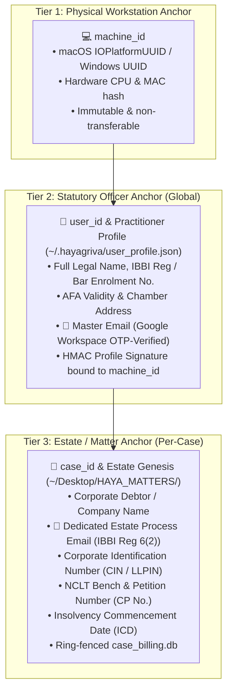

# Practice Governance, Identity Triad & Estate Genesis Architecture

## Executive Overview
This document defines the statutory governance, identity management, and matter provisioning architecture for the **Hayagriva Sovereign Legal AI** desktop environment and the **LEXAI Cloud Intelligence Gateway**.

Operating under the **Insolvency and Bankruptcy Code, 2016 (IBC)**, the **Advocates Act, 1961**, and Section 79A of the **Information Technology Act, 2000**, the system replaces arbitrary, self-reported metadata with a verifiable, non-repudiable **3-Tier Identity Triad**:



---

## 1. The 3-Tier Identity Triad

### Tier 1: Hardware Machine Anchor (`machine_id`)
* **Source**: Auto-detected from the operating system via `backend/lib/utils/machine-fingerprint.js`.
  * macOS: `ioreg -rd1 -c IOPlatformExpertDevice` -> `IOPlatformUUID`.
  * Windows: `Get-CimInstance -Class Win32_ComputerSystemProduct` -> `UUID`.
  * Linux: `/etc/machine-id`.
* **Format**: Normalized to `${PREFIX}-${SHA256_HASH_16}` (e.g., `MAC-3F9BCD5E811C5B7B`).
* **Role**: Cryptographically locks software licensing, local SQLite telemetry databases, and statutory diligence audit vouchers to the physical workstation.

### Tier 2: Statutory Officer Anchor (`user_id` & Master Email)
* **Storage**: `~/.hayagriva/user_profile.json`.
* **Role**: Represents the individual Advocate or Insolvency Professional (IP) personally responsible for filings, affidavits, and agent oversight.
* **Fields**:
  * `fullName`: e.g. `Adv. Atul Grover`.
  * `designation`: `Advocate & Insolvency Professional`, `Liquidator`, etc.
  * `ibbiRegNo`: e.g. `IBBI/IPA-001/IP-P01234/2018-2019/11987`.
  * `barEnrollmentNo`: e.g. `P/2418/2006`.
  * `afaValidity`: Authorisation for Assignment validity (e.g. `Valid up to 31-Dec-2027`).
  * `email`: **Master Practitioner Email** (e.g. `atul@resolutionbazaar.com`).
  * `phone`: Contact mobile.
  * `officeAddress`: Physical chambers for service of legal notices.
  * `userId`: Deterministic ID derived from registration (e.g. `usr_8_2019_11987`).
  * `profileSignature`: SHA-256 hash computed over `userId + email + fullName + machineId`.
* **OTP Verification**:
  * Handled via **Google Workspace SMTP** (`smtp.gmail.com:465/587`) using official domain credentials (2,000 emails/day quota).
  * Dev Sandbox Fallback: If run without credentials, logs 6-digit code cleanly to terminal console.

### Tier 3: Estate / Matter Anchor (`case_id` & Dedicated Process Email)
* **Storage**: `conversions/case_manifest.json` and `ledgers/case_billing.db` under each matter in `~/Desktop/HAYA_MATTERS/<MatterName>/`.
* **The Dual-Email Distinction (Statutory Mandate)**:
  * Under **Regulation 6(2) of IBBI Regulations, 2016**, the IP must notify a dedicated process email in Form A public announcements (e.g. `cirp.noidamarketing@gmail.com`).
  * This email belongs strictly to the Corporate Debtor’s estate and is handed over to the liquidator or incoming RP upon transition. It is strictly separate from the practitioner's Master Email.
* **Canonical `case_id` Derivation**:
  * If CIN is provided: `CIRP_${CIN}_${CP_NUMBER_SLUG}` (e.g. `CIRP_U45201HR2015PLC054321_dHry2024`).
  * Fallback: `CIRP_${MATTER_NAME_SLUG}`.

---

## 2. The 5 Statutory Pillars of the Practice Governance Cockpit

In the top menu under `Hayagriva > 🏛️ Practice Governance & Cockpit`:

1. **🛡️ Human-In-The-Loop (HIL) Gatekeeper** (`Cmd+Shift+H`):
   * Zero-cost safety firewall.
   * Staged cloud MCP dispatches (`@Precedent`, `@Forensic`) and agent inquests requiring practitioner confirmation before any external call or fee occurs.
2. **💳 CIRP Expense & Diligence Ledger** (`Cmd+Shift+B`):
   * Reimbursable Insolvency Resolution Process Costs (IRPC) under Section 5(13) of the IBC.
   * Dynamic task titling, SHA-256 tamper-evident receipts, CoC schedule export, and direct links to cryptographic traces on Langfuse Cloud.
3. **📈 Local Telemetry & Observability**:
   * Tracks on-device neural compute spans (InLegal-SBERT embeddings, MiniLM cross-encoder reranking, and local LLM tokens).
   * 100% free / included (`₹0.00`) with data residency audit badges.
4. **⚙️ Practice Settings & AI Engines** (`Cmd+,`):
   * Local LegalParam (Port 8090) vs. Lite Mode vs. Cloud Fallback routing.
5. **🔑 Software Licensing & Machine Identity**:
   * Hardware machine UUID display, verified practitioner credentials, live digital stamp, and Razorpay Pro subscription management.

---

## 3. Case Provisioning & Statutory Taxonomy

When the practitioner invokes **`➕ New Matter / CIRP Estate…`** (`Cmd+Shift+N`), the system automatically provisions:

```
~/Desktop/HAYA_MATTERS/<Corporate_Debtor_Name>/
├── 01_Pleadings_and_Orders/       # Section 7/9/10 admissions, interim applications
├── 02_Public_Announcements/       # Form A, Form G, newspaper publications
├── 03_Claims_and_Verification/   # Form B, Form C, CA verifications, claims matrix
├── 04_Financials_and_Audits/      # Balance sheets, bank books, forensic audits
├── 05_CoC_Meetings/               # Notices, agendas, minutes, voting logs
├── 06_Avoidance_PUFE/             # Section 43, 45, 50, 66 forensic transaction inquests
├── 07_Resolution_Plans/           # RFRP, Information Memorandum, evaluation matrix
├── RBZ_reports/                   # Delivered diligence reports with SHA-256 seals
├── conversions/
│   └── case_manifest.json         # Locks case_id, CIN, petition no, estate email, IP
├── ledgers/
│   └── case_billing.db            # SQLite ring-fenced ledger (tasks, receipts, telemetry)
├── drafts/                        # In-progress pleadings and briefs
└── reviews/                       # Redlined compliance checklists
```

---

## 4. Evidentiary Audit Trail & Evidentiary Proof

Every legal work product generated inside Hayagriva carries the unbroken evidentiary chain:
```text
__________________________________________________________________
[ATUL GROVER]
Advocate & Insolvency Professional • Grover & Associates | Resolution Bazaar
IBBI Reg: IBBI/IPA-001/IP-P01234/2018-2019/11987 | Bar Enrolment: P/2418/2006 | AFA: Valid up to 31-Dec-2027
Chambers: SCO No. 165-166, Sector 43-B, Chandigarh - 160043
Email: atul@resolutionbazaar.com | Phone: +91 98765 43210
[Workstation Anchor: MAC-3F9BCD5E811C5B7B • Verified via Hayagriva]
```
This stamp satisfies Section 79A of the Indian Evidence Act, verifying that the electronic record was generated under the direction of an enrolled statutory officer on an authenticated hardware workstation.
