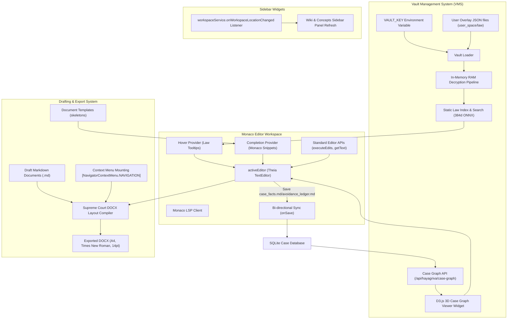
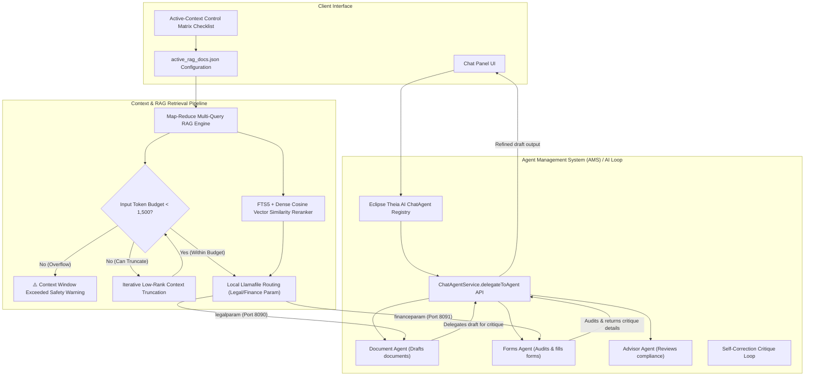

# HAYAGRIVA Architecture Diagrams & Commentary

This document serves as the central reference for the operational architecture of the HAYAGRIVA platform, split into three development stages. It includes Mermaid flowcharts and engineering notes detailing key design decisions, trade-offs, and verification checks.

---

## Stage 1: File Ingestion, Chunking, & Indexing Pipeline (IMS/CMS)

Stage 1 handles file conversion, layout excavation, semantic chunking, and lexical/vector indexing inside case-isolated SQLite databases.

```mermaid
graph TD
    %% Source Files
    subgraph Raw_Source_Files ["Raw Source Files"]
        PDF["📄 PDF File"]
        DOCX["📝 DOCX File"]
        XLSX["📊 XLSX File"]
        WIKI["🌐 TiddlyWiki (.wiki.html)"]
        MD["✍️ Markdown (.md)"]
    end

    %% Ingestion Parsers & Filters
    subgraph Ingestion_Management_System ["Ingestion Management System (IMS)"]
        PDF_GATE{"Text Density Check &gt; 30 chars/pg?"}
        PDF_ALERT["🚨 Block Ingest & Pop UI Alert (failed_convert)"]
        PDF_P["pdfexcavator Parser (Pages 1-3)"]
        
        DOCX_P["Mammoth Converter"]
        
        XLSX_SPLIT["xlsx-js Sheet Extractor"]
        XLSX_COMP["Write Separate Companions: <basename>_<sheetName>.md"]
        
        WIKI_P["Wiki JSON Scraper"]
    end

    %% Chokidar Watcher Loop
    subgraph File_Watcher_Loop ["File Watcher (Chokidar)"]
        WATCH_ADD_CHG["Add / Change Event"]
        DEBOUNCE_1S["Debounce 1000ms"]
        HASH_CALC["Calculate SHA-256 Hash"]
        HASH_CHECK{"Hash matches SQLite documents record?"}
        SKIP_EVENT["Skip Ingest (Unchanged)"]
        
        WATCH_DEL["Unlink (Delete) Event"]
        DEBOUNCE_2S["Debounce 2000ms"]
        CLEANUP_DB["Self-Healing DB & Index Cleanup"]
        CASCADED_DEL["Delete conversions/<basename>_*.md Sheets"]
    end

    %% Routing & Chunking
    subgraph Processing_NLP_Layer ["Processing & NLP Layer"]
        CHUNKER["Parent-Child Text Splitter"]
        BM25_TOK["BM25 Lexical Tokenizer"]
        
        DOMAIN_R["Domain Vertical Router"]
        LEGAL_EMB["Local ONNX Legal Model (inlegal-sbert)"]
        FIN_EMB["Local ONNX Finance Model (finance-embeddings-investopedia)"]
    end

    %% Storage Layer
    subgraph SQLite_Database ["SQLite Database (case_vault.db)"]
        FTS_TABLE["FTS5 Virtual Table (fts_chunks)"]
        VEC_TABLE["document_vectors Table"]
    end

    %% IMS Connections
    PDF --> PDF_GATE
    PDF_GATE -- "No (Scanned)" --> PDF_ALERT
    PDF_GATE -- "Yes (Digital)" --> PDF_P
    
    DOCX --> DOCX_P
    XLSX --> XLSX_SPLIT
    WIKI --> WIKI_P
    MD --> WATCH_ADD_CHG

    PDF_P --> WATCH_ADD_CHG
    DOCX_P --> WATCH_ADD_CHG
    
    XLSX_SPLIT --> XLSX_COMP
    XLSX_COMP --> WATCH_ADD_CHG
    WIKI_P --> WATCH_ADD_CHG

    %% Watcher Connections
    WATCH_ADD_CHG --> DEBOUNCE_1S
    DEBOUNCE_1S --> HASH_CALC
    HASH_CALC --> HASH_CHECK
    
    HASH_CHECK -- "Yes" --> SKIP_EVENT
    HASH_CHECK -- "No" --> CHUNKER
    HASH_CHECK -- "No" --> BM25_TOK

    WATCH_DEL --> DEBOUNCE_2S
    DEBOUNCE_2S --> CLEANUP_DB
    DEBOUNCE_2S --> CASCADED_DEL
    CASCADED_DEL --> WATCH_DEL

    %% Processing & Storage Connections
    BM25_TOK --> FTS_TABLE
    CHUNKER --> DOMAIN_R
    
    DOMAIN_R -- "Case/Path = Legal" --> LEGAL_EMB
    DOMAIN_R -- "Case/Path = Finance" --> FIN_EMB

    LEGAL_EMB --> VEC_TABLE
    FIN_EMB --> VEC_TABLE

    %% Styling
    style Raw_Source_Files fill:#111,stroke:#333
    style SQLite_Database fill:#111,stroke:#333
    style PDF_ALERT fill:#991b1b,stroke:#f87171,color:#fff
    style LEGAL_EMB fill:#1b365d,stroke:#3b82f6,color:#fff
    style FIN_EMB fill:#0b4c3e,stroke:#10b981,color:#fff
    style SKIP_EVENT fill:#1c1917,stroke:#78716c,color:#a8a29e
```

### Engineering Notes & Stage 1 Evaluation
1. **Thread-Safety via Sequential Queueing**:
   * Storing SQLite files per-case on disk is highly robust but prone to database lock collisions under concurrent writes.
   * We wrap all indexing/registration routines inside `watcher.js` in a sequential task queue (`ingestionQueue`). If a user drops multiple files at once, the queue serializes database executions, maintaining 100% write safety.
2. **Watcher Flood Control**:
   * Configured Chokidar with a **1000ms debounce** window on additions/changes to coalesce rapid system fires.
   * Before committing to a write pass, the system computes the SHA-256 hash of the document and compares it to the database record. If unchanged, the event is skipped early to protect resources.
3. **Scanned PDF Rejections**:
   * Evaluates text density during parsing. If average char count/page is `< 30` (fully scanned image PDFs), it blocks ingestion and returns a detailed `SCANNED_PDF_REJECTED` error.
   * Client-side tree decorators capture the error and toast it directly in the workspace to request digital PDF/MD inputs.
4. **Excel Tab Isolation**:
   * To prevent topic pollution across sheets during dense vector similarity scans, we split Excel workbooks into separate companion files `conversions/<basename>_<sheetName>.md`.
   * When the parent `.xlsx` is deleted, the watcher automatically cleans up all associated companion sheet files, cascading database and concept self-healing cleanups.

---

## Stage 2: Development Workspace, Editor integration & Syntax (VMS)

Stage 2 governs the law database (decryption, memory storage, user-space overlays), Monaco editor language features (hover tips, snippets, variable injections), and Supreme Court DOCX layout compilations.

### Engineering Notes & Stage 2 Evaluation
1. **Static Law Vault Offline Decryption**:
   * Decrypts the static law vault using a runtime `VAULT_KEY` loaded dynamically. The static index is kept entirely in RAM (384d ONNX) to protect proprietary legal documents from disk leaks.
   * If a custom user overlay JSON exists (in `user_overlays/`), the loader merges and overrides existing law IDs, allowing custom user-space modifications.
2. **Bi-directional Monaco-SQLite Sync**:
   * The LSP parser intercepts saves to critical files (`claims_registry.md`, `avoidance_ledger.md`, and `case_facts.md`).
   * It parses Markdown tables and syncs key-value configurations directly back to SQLite records and `case_kv_dictionary.json` (setting `verified_by_user = 1` for human-edited entries).
3. **Monaco Hover and Snippets**:
   * Law code IDs (e.g. `Section 43`) trigger tooltips in the editor on mouse-hover by querying the RAM Law Index.
   * Templates automatically convert blank lines (e.g. `_____`) and variables (e.g. `[date]`, `[amount]`) to Monaco tab-stops (`${1:_____}` or `${2:date}`), speeding up the lawyer's drafting loop.
4. **Standard Editor Selection APIs**:
   * To maintain integration safety across Theia and Monaco editor windows, we reject Monaco-specific selection APIs like `.getSelectedText()` or `.replaceSelection(...)`.
   * Instead, we use standard Theia wrapper APIs:
     * *Read selection*: `activeEditor.editor.document.getText(activeEditor.editor.selection)`
     * *Modify selection*: `activeEditor.editor.executeEdits([{ range: activeEditor.editor.selection, newText: ... }])`
5. **D3.js 3D Case Graph Viewer**:
   * The UI compiles a dynamic mapping of documents, claims, concepts, and wiki entries by hitting `/api/hayagriva/case-graph`.
   * It uses D3.js force-directed graphs to render relational connections, facilitating interactive node selection and quick-jump navigation.
6. **Workspace Context Menu Group Mounting**:
   * Custom context menus (like `/export-sc` or Excel sheets builder commands) must target a valid group (e.g. `[...NavigatorContextMenu.NAVIGATION]`). Omitting group paths breaks Lumino menu hierarchy registration, preventing context options from displaying.
7. **Active Location Sidebar Listeners**:
   * Sidebar views (Wiki Accordion, Concepts checklist Matrix) hook into `workspaceService.onWorkspaceLocationChanged` to refresh layout state and database queries whenever the user switches case directories.

---

## Stage 3: Cognitive Agents, Critique Loops & RAG Pipeline (AMS)

Stage 3 manages specialized AI agents (Advisor Agent, Forms Agent, Document Agent), context matrix selection filters, token budget checks, and routing to local offline Llamafile engines.

### Engineering Notes & Stage 3 Evaluation
1. **Strict Context Budget & Truncation (CMS)**:
   * Local models (LegalParam / FinanceParam) run on a strict 2,048-token context window limit (~1,500 words).
   * RAG prompts calculate BPE token counts pre-flight. If the count exceeds 1,500 tokens, it iteratively drops the lowest-ranked context chunks one by one.
   * If a single chunk overflows, the engine returns a clean warning alert to the user instead of letting the local LLM loop or crash.
2. **Context Control Matrix**:
   * Users can select/exclude documents from the concepts checklist panel. Persisted in `active_rag_docs.json`, it filters RAG vector matching lists prior to LLM submission.
3. **Local Llamafile Port Routing**:
   * Case directories are dynamically scanned for vertical keywords (`ibc`, `finance`) or metadata configuration.
   * Prompts route to Port `8090` (LegalParam-7B) or Port `8091` (FinanceParam-2.9B) accordingly.
4. **Agent Critique Loops**:
   * Specialised subagents collaborate programmatically via Eclipse Theia AI's delegation APIs (`delegateToAgent`).
   * The Document Agent delegates drafts to the Forms Agent for compliance audit, refining the final draft with the critique suggestions before showing it to the user.
