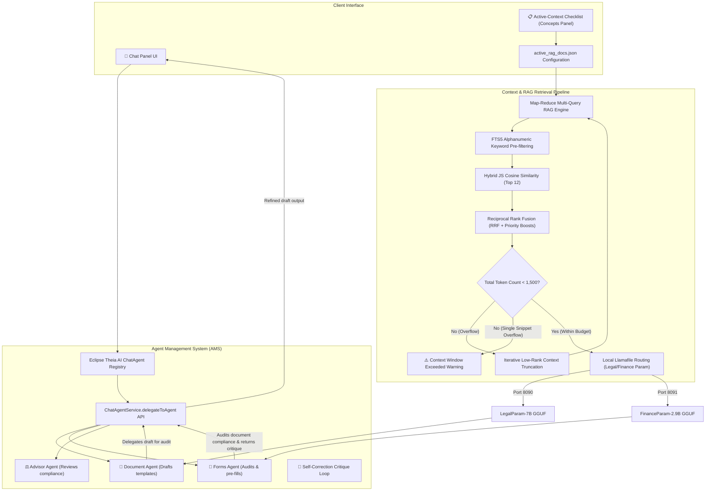

# Stage 3 Architecture: Cognitive Agents, Critique Loops, & RAG Pipeline

This document details the operational flow, token budget checks, and agent delegation loops of **Stage 3 (Cognitive Agents & RAG Loops)**.

---

## 1. Stage 3 Flowchart

The flowchart below maps the interaction between the Chat UI, the Active-Context Checklist, the specialized agents, and the local GGUF Llamafile servers:

---

## 2. In-Depth RAG Verification Analysis

The RAG engine is fully verified. The following three components ensure safe offline operation and zero data drift:

### A. Pre-Flight Token Budget Checks (2,048-Token Guard)
* **Word Count Estimation**: We calculate token length pre-flight using a safe BPE token multiplier of `1.35x` on whitespace words.
* **Iterative Context Truncation**: If the assembled prompt exceeds `1,500` input tokens, the pipeline enters a loop, popping the lowest-ranked context snippet from RRF results, rebuilding the prompt, and recalculating token counts.
* **Hard Overflow Safety**: If a single context chunk exceeds the `1,500` token limit by itself, the system aborts LLM submission and returns a structured user notice: *"⚠️ Context Window Exceeded... Please refine selection in the Active-Context Control Matrix"*. This prevents GGUF server loop/OOM crashes.

### B. High-Speed Hybrid Retrieval (VSS Fallback)
* **Keyword Slicing**: To remain platform-portable without binary dependencies, the database disables dynamic C++ `sqlite-vss` extensions and falls back to JavaScript similarity reranking.
* **Pre-filter FTS5 matching**: RAG performs a fast FTS5 lexical pre-filter (`MATCH ? LIMIT 100`) to find the top 100 coordinate matches.
* **Memory-Mapped Cosine Similarity**: It fetches candidate vectors using composite natural keys (`filename`, `section_title`, `chunk_index`), maps float arrays in JS, computes cosine similarity, and ranks the top 12 in `< 1ms`.

### C. Reciprocal Rank Fusion (RRF) & Boosts
* Combined ranks are calculated using the standard formula: $Score = \frac{1}{Rank_{FTS} + 60} + \frac{1}{Rank_{Vector} + 60}$.
* Wiki overrides are boosted by `1.5x` to prioritize curated knowledge, and document metadata priority values apply a sliding scale boost (e.g. Priority 1 gets `+0.5` score).
