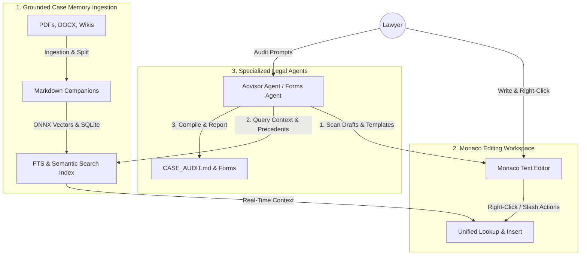

# Chapter 0: HAYAGRIVA System Architecture Overview

This chapter outlines the modular design of the HAYAGRIVA platform. The system is partitioned into six specialized, cooperative **Management Systems**.

---

## The Six Management Systems

```
                       ┌────────────────────────┐
                       │   Workspace (WMS)      │ (Case Sandboxing & Server)
                       └───────────┬────────────┘
                                   │
         ┌─────────────────────────┼─────────────────────────┐
         ▼                         ▼                         ▼
 ┌──────────────┐          ┌──────────────┐          ┌──────────────┐
 │  Ingestion   │          │   Context    │          │    Vault     │
 │  (IMS)       │          │   (CMS)      │          │    (VMS)     │
 └──────┬───────┘          └──────┬───────┘          └──────┬───────┘
        │                         │                         │
        └─────────────────────────┼─────────────────────────┘
                                  │
                                  ▼
                       ┌────────────────────────┐
                       │    Drafting (DMS)      │ (Templates & Versioning)
                       └───────────┬────────────┘
                                   │
                                   ▼
                       ┌────────────────────────┐
                       │    Agents (AMS)        │ (Subagents & Theia AI)
                       └────────────────────────┘
```

### 1. Workspace Management System (WMS)
* **Description:** Manages the active case context, workspace directory isolation, local API routing, and central configurations.
* **Key Files:**
  - `hayagriva/lib/api-server.js` (Server hosting and port lock management)
  - `reviews/case_kv_dictionary.json` (Central variables overlay store)
  - `/Documents/Case_<Name>/` (Sanitized case isolation directories)

### 2. Ingestion Management System (IMS)
* **Description:** Parses raw client files (PDF, Word, Excel, TiddlyWiki) and outputs structured companion Markdown logs.
* **Key Files:**
  - `hayagriva/lib/pipeline/pdf/ingest.js` (PDF pages pagination)
  - `hayagriva/lib/pipeline/docx/` & `hayagriva/lib/pipeline/xls/` (Mammoth fallbacks & cell merging filters)
  - `hayagriva/lib/pipeline/wiki/upload.js` (JSON store blocks scraper)

### 3. Context Management System (CMS)
* **Description:** Manages text chunking (parent-child splits), pageindex tree layouts (`pageindex_tree.json`), compounding 2–3 sentence legal summaries, and 4-stage hybrid RAG retrieval (FTS5 + Dual Embeddings + RRF + Native ONNX Cross-Encoder Reranking).
* **Key Files:**
  - `backend/lib/core/rag.js` (4-stage hybrid retriever: SQLite FTS5, bi-encoder embeddings, RRF fusion, and cross-encoder reranking)
  - `backend/lib/core/reranker.js` (Native ONNX cross-encoder using `ms-marco-MiniLM-L-6-v2` with 5m TTL memory eviction)
  - `backend/lib/pipeline/common/helper.js` (PageIndex Flash hierarchical tree parser & parent-child chunk splitter)
  - `concepts/pageindex_tree.json` (Compounding legal tree structure with section summaries)

### 4. Vault Management System (VMS)
* **Description:** Manages encrypted statutory databases, RAM decryption/decompression pipelines, user overlays, Monaco completion providers, and relational case maps.
* **Key Files:**
  - `vault-loader.js` (AES-256-GCM streams decryption and overlays merge bypass)
  - `hayagriva-extension/src/browser/extension.ts` (Monaco completion, hover, and webview managers)
  - `hayagriva-extension/src/browser/templates.ts` (D3.js force-directed graph template)

### 5. Drafting Management System (DMS)
* **Description:** Manages layout templates, placeholder markers, and draft version control.
* **Key Files:**
  - `hayagriva/lib/core/drafting.js` (Document compilation & placeholders checklist compiler)
  - `formats/` (Layout templates and prompts dictionary)
  - `drafts/` (Archived `.v1.md` revisions & comparisons)

### 6. Agent Management System (AMS)
* **Description:** Coordinates specialized subagents (Advisor, Forms, Document) and structures agent-to-agent critique loops.
* **Key Files:**
  - `agent-coordinator.js` (LLM intent classification router)
  - `advisor-agent/`, `forms-agent/`, `document-agent/` (Agent prompts & personas)
  - Theia AI `ChatAgentService` (Native delegation loop host)

---

## The 3+3 Distinction: Workflow Steps vs. Utility Engines

To understand the architecture, we distinguish between **Workflow Steps** (what the user interacts with) and **Utility Engines** (the invisible background libraries that power those steps):

### A. The 3 Workflow Steps (Direct User Interactions)
These represent the concrete steps of the legal professional's document lifecycle:
1. **Ingestion (IMS):** The *Input Phase* where raw text is parsed and converted.
2. **Monaco Editor (VMS):** The *Verification Phase* where inline diagnostics and completions are presented in Monaco.
3. **Agents (AMS):** The *Output Phase* where chat agents are invoked to write drafts or checklist audits.

### B. The 3 Utility Engines (Background Core Services)
These do not have independent user interfaces or make autonomous decisions; they act as the system's underlying OS, database, and compiler:
1. **Workspace System (WMS):** The *Operating System* that sandboxes case files and handles local server endpoints.
2. **Context System (CMS):** The *Memory* that performs keyword indexing and semantic RAG lookups.
3. **Drafting System (DMS):** The *Compiler* that runs mail-merge templating and version incrementing.

---

## The Three Pillars of User Interaction (The Legal IDE Model)

From a user and workflow perspective, HAYAGRIVA is built around three interactive pillars that act as a **Self-Contained Legal IDE**:



### 1. Grounded Case Memory (Ingestion)
*   **Purpose:** The fact-verification engine of the case.
*   **Mechanism:** Raw files are ingested and tokenized locally into markdown, SQLite databases, and semantic ONNX vectors.
*   **Failsafe:** This serves as the system's "source of truth," grounding all subsequent drafting in raw evidence to prevent AI hallucination.

### 2. Monaco Workspace (Drafting & Editing)
*   **Purpose:** The central workbench for the lawyer.
*   **Mechanism:** Standard autocomplete actions, templates, and contextual lookup tools (Statutes, Judgments, and Case Concepts) are integrated directly into Monaco via right-click triggers and slash commands.
*   **LSP Integration:** Powered by a custom Node.js background LSP service using `vscode-markdown-languageservice` to perform real-time path completions, rich hover previews, and interactive linter diagnostics.
*   **Failsafe:** Lawyers stay inside a single unified text editor, referencing laws and precedent summaries inline.

### 3. Specialized Legal Agents (Curation & Auditing)
*   **Purpose:** Specialized automated associates checking quality and compliance.
*   **Mechanism:** The subagents run in-context to audit draft quality, detect unresolved placeholders, verify timeline gaps, and output compliance audits (like `CASE_AUDIT.md`) and pre-filled corporate filings.

