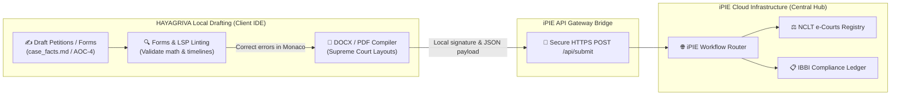

# Comparative & Integration Matrix: HAYAGRIVA vs iPIE

This reference guide establishes the comparative positions and integration pathways between **HAYAGRIVA (Local Legal Development Environment)** and the **iPIE Platform (Integrated Platform for IBC Ecosystem)**.

---

## 1. Comparative Matrix

The table below outlines the design philosophies, target scopes, and capabilities of the two platforms:

| Feature / Dimension | HAYAGRIVA Desktop IDE | iPIE Central Cloud Platform |
| :--- | :--- | :--- |
| **Operational Architecture** | 100% Local, offline desktop application (sandboxed to local directories). | Centralized cloud-based government platform with public API endpoints. |
| **Privacy & Privilege** | Privacy-first. Active client files, draft directories, and vector indexes remain strictly on the host machine. | Consolidated database. Regulatory reporting records, filings, and public announcements are shared across pillars. |
| **Primary Target User** | Advocacy Professionals, Insolvency Professionals (IPs), and Legal Drafters. | Regulatory bodies (IBBI, MCA), Adjudicating Authorities (NCLT/NCLAT), and creditors. |
| **AI & LLM Integration** | Offline local LLM servers (LegalParam/FinanceParam) running via Llamafile on CPU. | Centralized cloud analytics, macro-level dashboarding, and audit logging. |
| **Validation Layer** | Pre-flight "Malpractice Linting" (LSP AST validations, mathematical formula/date audits) *prior* to submission. | Cloud-side database checks, regulatory threshold gates, and validation reviews. |
| **Document Control** | Version-controls draft layouts locally using background Git checkpoints. | Maintains official filing timelines and permanent case progress snapshots. |
| **Input Format Adaptability** | Raw unstructured files (PDF, Word, Excel sheets, Wikis) converted dynamically to Markdown. | Standardized schema inputs, JSON form structures, and digital PDF uploads. |

---

## 2. Integration Touchpoints: How They Work Together

HAYAGRIVA is not a competitor to iPIE; it serves as the **high-fidelity local client (Legal IDE)** that prepares, audits, and formats files before pushing them into the **iPIE cloud ecosystem**:

### Key Synergy Scenarios:
1. **Form Ingestion & Pre-audit (The Forms Agent)**:
   * *Problem*: In iPIE, filing erroneous forms leads to rejection delays.
   * *Solution*: The IP drafts disclosures in HAYAGRIVA. The local `FormsAgent` runs mathematical audits on the draft values. Once validated locally, HAYAGRIVA exports a clean JSON schema directly to iPIE's API.
2. **Scanned PDF Mitigation**:
   * *Problem*: iPIE requires digital files to enable data extraction, but users often upload scanned images.
   * *Solution*: HAYAGRIVA's scanned PDF gate blocks image-only files at the local explorer tree, forcing the lawyer to convert them to Markdown before filing to iPIE.
3. **Structured Case Chronologies**:
   * *Problem*: Coordinating chronological dates across corporate minutes and court pleadings is manually intensive.
   * *Solution*: HAYAGRIVA compiles a local `timeline.md` index. Upon filing, this timeline maps to iPIE's **Unique Case ID Ledger**, keeping case events unified.
4. **Drafting and Petitions compilation**:
   * *Problem*: Creating court-ready petitions conforming to strict layouts takes hours.
   * *Solution*: The local Document Agent compiles template skeletons into Supreme Court-ready DOCX files, which are then signed and submitted to the iPIE e-courts gateway.

---

## 3. Missing Out-of-the-Box (OOB) & Out-of-Band Integration Gaps

To ensure seamless production-level integration, we must resolve these four critical, unaddressed gaps:

### A. Air-Gapped / Out-of-Band (OOB) Package Exports
* **The Gap**: HAYAGRIVA is designed to run in highly secure, sometimes entirely offline or air-gapped corporate environments. iPIE operates on the cloud. If the local IDE has zero internet connection, direct API endpoints cannot be reached.
* **Proposed Resolution**: Implement a local **"iPIE Sync Packager"** that bundles all validated files, JSON schemas, metadata signatures, and chronologies into a single, encrypted `.ipie.pack` file. The user can copy this file onto a USB drive and upload it to the iPIE portal from an internet-enabled computer.

### B. Offline Digital Signature Certificate (DSC) & API Token Vault
* **The Gap**: Filings to iPIE must be authenticated and digitally signed (using lawyer/IP DSC tokens or Aadhaar-based e-Sign). Currently, there is no offline vault in HAYAGRIVA to manage certificates, client credentials, or DSC key handshakes.
* **Proposed Resolution**: Add a **"Security Vault"** inside the Vault Management System (VMS) to securely store DSC signatures and OAuth2 client tokens, enabling one-click local signing of PDF/JSON payloads before transmission.

### C. Dynamic Schema Evolution & Sync
* **The Gap**: Reporting layouts, thresholds, and form fields (e.g. AOC-4 compliance rules) change frequently on the regulatory side (IBBI/MCA). Stale offline schemas in the local IDE will result in API submissions being rejected by the cloud router.
* **Proposed Resolution**: Set up a **schema synchronization daemon** that checks for schema updates. In air-gapped mode, allow the user to manually import a signed `schemas_update.json` file to keep the local `validateFormRules` engine current.

### D. Temporary-to-Permanent Case ID Mapping
* **The Gap**: Locally created cases in HAYAGRIVA will not have an official iPIE case number before NCLT registration. There is no mechanism to link local files under a temporary hash, which is later mapped to the permanent iPIE Case ID once the case is admitted.
* **Proposed Resolution**: Implement a pre-filing temporary ID scheme. When the case is officially registered in iPIE, the API returns the permanent ID, and HAYAGRIVA executes a local database refactoring sweep, mapping all FTS5/vector indices and file headers to the new permanent iPIE identifier.

