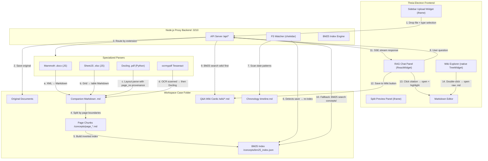
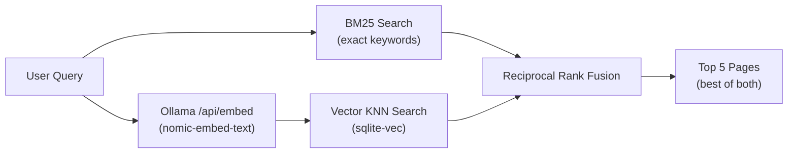

# Implementation Plan — Legal Ingestion, Retrieval, & Dynamic Case Wiki

Pivot the architecture to utilize **pageIndex-based chunking** during ingestion, implement a curated **Case Q&A Wiki** with interactive citation highlighting, SSE-streamed RAG responses, a custom BM25 search engine, and auto-compiled chronological timelines — all built on native Eclipse Theia extension APIs.

*Includes Phase 2 roadmap for hybrid search and advanced IDE-native layouts.*

---

## System Architecture & Data Flow



---

## 1. Multi-Format Specialized Ingestion

### A. Dedicated File Parsers

#### PDF Documents (`.pdf`) — Docling with Provenance API
* Parsed using **Docling** (Python library) via a dedicated helper script `scripts/docling_convert.py`.
* **Digital Mode** (default): Runs Docling with `do_ocr = False` for fast layout & vector table parsing.
* **Scanned Mode**: Runs `ocrmypdf` OCR first to create a searchable PDF, then passes it to Docling.
* **Page Number Extraction**: Instead of relying on generic markdown export, the script iterates `result.document.body.items` and reads each element's `item.prov[0].page_no` provenance metadata. This gives us **real PDF page numbers** for each text block.
* **Output Format**: The Python script outputs a JSON structure to stdout:
  ```json
  {
    "pages": [
      { "page_no": 1, "content": "## Page 1\n\nFirst page text..." },
      { "page_no": 2, "content": "## Page 2\n\nSecond page text..." }
    ],
    "total_pages": 42
  }
  ```
* Node.js reads this JSON and writes each page as `page_1.md`, `page_2.md`, etc.

#### Word Documents (`.docx`) — Mammoth + Paragraph Chunking
* Parsed to clean Markdown using the `mammoth` npm package (XML → Markdown conversion) in milliseconds.
* **Page breaks are NOT detectable** — Mammoth ignores the `w:lastRenderedPageBreak` XML element by design, because it's unreliable (may be stale or missing). We do NOT attempt XML parsing for page breaks.
* **Primary chunking strategy** (not a fallback):
  1. If the generated Markdown contains heading structure (`##`, `###`), split by headings.
  2. If no headings exist, or if any resulting chunk exceeds **800 words**, group every **8 paragraphs** into a block.
  3. Label each chunk with an artificial page header (`## Page X`) to maintain a consistent `pageIndex` pattern across all document types.

#### Excel Spreadsheets (`.xlsx`) — SheetJS with Header Replication
* Parsed to Markdown Tables using the `xlsx` (SheetJS) npm package.
* Each worksheet tab becomes a `# Tab Name` header.
* **Row-chunking for massive tables**: Tables exceeding 100 rows are split into paginated chunks (`Sheet 1 (Rows 1–100)`, `Sheet 1 (Rows 101–200)`).
* **Header row replication**: The column header row(s) from the original table are **automatically prepended** to every chunk so that the LLM always has column context:
  ```markdown
  ### Sheet 1 (Rows 101–200)
  | Creditor Name | Amount (₹) | Date | Status |
  | --- | --- | --- | --- |
  | Row 101 data... |
  ```

### B. pageIndex Chunking Structure
* All document types produce chunks named `page_1.md`, `page_2.md`, etc. inside a `/concepts/<docname>/` folder.
* PDFs get **real page numbers** from Docling's provenance API.
* Word documents get **synthetic page numbers** from heading/paragraph grouping.
* Excel sheets get **sheet + row range** identifiers.
* This reduces file count by **10x to 50x** compared to heading-inferred splitting, dramatically optimizing BM25 indexing and retrieval speed.

---

## 2. Interactive Legal RAG & Curated Wiki

### A. The "Save to Case Wiki" Curation Loop
* Each RAG response in the chat panel displays a **[ 💾 Save to Case Wiki ]** button.
* Clicking this button writes a Markdown file inside `/Documents/<Case_Name>/wiki/` with:
  ```markdown
  ---
  question: "What is the CIRP timeline?"
  sources: ["handbook.md#Page_12", "order_2023.md#Page_3"]
  savedAt: "2026-07-07T12:00:00Z"
  ---
  # What is the CIRP timeline?

  The CIRP was initiated on 15.03.2023 when...
  [Page 12](handbook.md#Page_12) | [Page 3](order_2023.md#Page_3)
  ```
* **Wiki Override Priority**: In the BM25 search pipeline, the `/wiki/` folder is scored with a **1.5x boost multiplier** so curated answers always surface above raw page chunks. If a wiki card matches the query, it replaces raw-text retrieval entirely.

### B. Click-to-Highlight Citation Navigation
* Citation links (e.g. `[Page 36]`) in RAG responses are rendered as clickable elements.
* **Clicking a citation** triggers the following chain:
  1. The RAG Chat iframe sends a `postMessage` to the parent window:
     ```javascript
     window.parent.postMessage({
       type: 'open-citation',
       filePath: '/Documents/Case_Alpha/handbook.md',
       anchor: 'Page 36'
     }, '*');
     ```
  2. The extension's message listener scans the companion Markdown file for `## Page 36`.
  3. Opens the file via `EditorManager.open(uri, { selection: { start: { line: lineIndex, character: 0 } } })`.
  4. Applies a **temporary yellow highlight decoration** over the cited section (page header + next 20 lines) using `createTextEditorDecorationType`:
     ```typescript
     const citationHighlight = createTextEditorDecorationType({
       backgroundColor: 'rgba(255, 200, 0, 0.25)',
       border: '1px solid rgba(255, 200, 0, 0.6)',
       isWholeLine: true
     });
     editor.setDecorations(citationHighlight, [range]);
     setTimeout(() => editor.setDecorations(citationHighlight, []), 5000);
     ```
  5. The highlight automatically fades after **5 seconds**.

### C. Cross-Document Timeline Compiler
* A dedicated `lib/timeline.js` module scans all `page_*.md` files during ingestion.
* **Date pattern recognition**: Matches formats like `DD.MM.YYYY`, `DD/MM/YYYY`, `DD-MM-YYYY`, `DD Month YYYY`, `Month DD, YYYY`, and ISO `YYYY-MM-DD`.
* **Event extraction**: Captures the sentence containing the date plus surrounding context (±1 sentence).
* **Output**: Compiles events chronologically into `/Documents/<Case_Name>/timeline.md`:
  ```markdown
  # Case Timeline

  | Date | Event | Source |
  | --- | --- | --- |
  | 15.03.2023 | CIRP initiated against Corporate Debtor | [handbook.md Page 12](handbook.md#Page_12) |
  | 22.06.2023 | Resolution plan submitted by SRA | [order_2023.md Page 3](order_2023.md#Page_3) |
  ```
* The watcher re-compiles the timeline whenever any `page_*.md` or `wiki/*.md` file is modified.

### D. Extended UI Layout & Theia Widget Architecture

#### Case Wiki Explorer — Native TreeWidget (NOT an iframe)
* Implement as a proper Theia `TreeWidget` subclass registered via `AbstractViewContribution` and `WidgetFactory`.
* **Icon**: Book symbol (`fa fa-book`) in the left Activity Bar.
* **Tree nodes**: Each node represents a `.md` file inside the `/wiki/` folder.
* **Double-click behavior**: Opens the raw Markdown file directly in the editor via `EditorManager.open()`.
* **Advantages over iframe**: Automatic theme inheritance, native drag-and-drop, direct access to Theia DI services, no `postMessage` bridge needed.
* **Registration** in `hayagriva-frontend-module.ts`:
  ```typescript
  bind(WikiTreeWidget).toSelf();
  bind(WidgetFactory).toDynamicValue(ctx => ({
    id: 'hayagriva-wiki-explorer',
    createWidget: () => ctx.container.getAsync(WikiTreeWidget)
  }));
  bind(AbstractViewContribution).to(WikiExplorerContribution);
  bind(FrontendApplicationContribution).toService(WikiExplorerContribution);
  ```

#### Sidebar Upload Widget — Iframe (kept for now)
* Remains as an iframe with `srcdoc` for rapid iteration.
* Sidebar HTML renders three stacked upload zones:
  1. **PDF Zone** (Red themed) — toggle for *Digital* vs *Scanned* mode
  2. **Word Zone** (Blue themed)
  3. **Excel Zone** (Green themed)
* Replace `window.parent.hayagrivaXyz()` globals with a structured `postMessage` protocol:
  ```javascript
  // Instead of: window.parent.hayagrivaOpenPreview(...)
  // Use:
  window.parent.postMessage({
    type: 'hayagriva:open-preview',
    payload: { caseName, filePath, profile, option }
  }, '*');
  ```

#### RAG Chat Panel — Iframe with SSE Streaming
* Kept as an iframe for now, but upgraded with SSE (Server-Sent Events) streaming.
* Instead of waiting 5–15 seconds for a complete response, the chat renders tokens as they arrive.
* The **[ 💾 Save to Wiki ]** button appears after the stream completes.
* **Ambient Ingestion Badge**: A spinning gear animation on the Upload sidebar icon when background OCR is running.
* **Editor Toolbar Bot Icon**: A robot icon (`fa fa-magic`) in the top-right toolbar of Markdown active editor tabs — clicking it opens the RAG Panel and auto-focuses the conversation on that specific open document.

### E. Local BM25 Inverted Search Index

#### Custom Implementation (~150 lines, zero npm dependencies)
* Implemented in a new `lib/bm25.js` module with three core functions:
  1. **`buildIndex(documents)`** — Tokenizes, stems, and builds an inverted posting list.
  2. **`search(index, query, topK)`** — Scores documents using BM25 with $k_1 = 1.5$, $b = 0.75$.
  3. **`tokenize(text)`** — Lowercases, strips punctuation, removes English/legal stop words, applies Porter stemming.

#### Index Format (`bm25_index.json`)
```json
{
  "version": 1,
  "avgDocLength": 342,
  "totalDocs": 85,
  "docLengths": { "page_1.md": 412, "page_2.md": 289 },
  "postings": {
    "default": { "df": 12, "docs": { "page_3.md": 3, "page_7.md": 1 } },
    "resolut": { "df": 8, "docs": { "page_1.md": 5, "page_12.md": 2 } }
  }
}
```

#### Auto-Sync on Edit
* The file watcher in `watcher.js` listens for save/change events on:
  - Companion `.md` files
  - `/wiki/*.md` files
  - `/concepts/*/page_*.md` files
* On change, the affected document is **incrementally re-indexed** (removed from all posting lists, re-tokenized, re-inserted) without rebuilding the entire index.
* Search completes in **<10 milliseconds** for typical case folders (50–200 page files).

### F. Unified Local/Cloud LLM Client

#### New Module: `lib/llm-client.js`
* **Dynamic Provider Factory** supporting three backends:
  * **Ollama (Local Default)**: Queries `127.0.0.1:11434/api/chat` with `stream: true`. Supports models: `qwen2.5:14b`, `qwen2.5:32b`, `llama3.2:latest`.
  * **Gemini (Cloud Fallback)**: Queries Google Gemini API using `GEMINI_API_KEY` env var.
  * **OpenAI (Cloud Alternative)**: Queries OpenAI API using `OPENAI_API_KEY` env var.
* **Fallback Chain**: Ollama → Gemini → OpenAI. If the primary fails (connection refused, timeout >3s), automatically try the next provider.
* **Streaming Interface**: All providers return an async iterator of text chunks, unifying the SSE pipeline regardless of which backend is active.
  ```javascript
  // Unified interface:
  async function* streamChat(messages, opts) {
    const provider = selectProvider(opts);
    yield* provider.stream(messages);
  }
  ```

### G. SSE Streaming for RAG Responses

#### New Endpoint: `POST /api/hayagriva/query-stream`
* Sets SSE headers: `Content-Type: text/event-stream`, `Cache-Control: no-cache`, `Connection: keep-alive`.
* Pipeline:
  1. Receive query from chat panel.
  2. Run BM25 search against wiki/ then concepts/ (< 10ms).
  3. Build prompt with top 5 retrieved pages (max 8,000 tokens).
  4. Stream LLM response token-by-token via `res.write(`data: ${chunk}\n\n`)`.
  5. After stream ends, send a final `data: [DONE]` event with metadata (sources, timings).
* **Frontend** uses the browser-native `EventSource` API to receive and render tokens incrementally.

### H. Context Window & Token Management Guardrails
* **Dynamic Context Discarding**: Across conversational turns, discard previously retrieved page contents. Only keep past questions and raw assistant answers.
* **Sliding Dialog Window**: Cap historical messages to the last **5 turns**, dropping older items.
* **Payload Constraints**: Hard cap of **5 retrieved pages** (`maxPages = 5`) and **8,000 tokens** (`maxContextTokens = 8000`) per prompt.
* **Conflict-Aware Prompting**: When retrieved pages come from different documents, the system prompt includes: *"If the sources contain conflicting information, explicitly note the conflict and cite both sources with their dates."*

### I. Multi-Document Conflict & Authority Resolution
* **Document metadata** in `index.json` gains two new fields:
  - `priority` (integer, 1 = highest authority, default = 5)
  - `documentDate` (ISO string, used for recency ranking)
* **Search-time blending**: When BM25 returns hits from multiple documents, the final score combines:
  - `finalScore = (bm25Score × 0.7) + (priorityBoost × 0.2) + (recencyBoost × 0.1)`
* The user can set document priority via a simple frontmatter field in the companion Markdown:
  ```yaml
  ---
  priority: 1
  documentDate: "2023-06-22"
  ---
  ```

### J. Document Comparison Diff View
* When two related documents exist in a case (e.g., `original_contract.md` and `amended_contract.md`), offer a **side-by-side diff view** highlighting differences.
* Leverages Theia's **built-in `DiffService`** and Monaco's diff editor — requires near-zero custom code.
* Accessible via right-click context menu on any Markdown file: **"Compare with..."** → file picker → instant redline view.
* Example visual:
  ```
  ┌─ original_contract.md ──────────┬─ amended_contract.md ────────────┐
  │ The penalty shall be 5% of      │ The penalty shall be ██ 8% ██ of  │
  │ the outstanding amount.         │ the outstanding amount.           │
  │ Payment due within 30 days.     │ Payment due within ██ 15 days ██. │
  └─────────────────────────────────┴───────────────────────────────────┘
  ```
* **Implementation**: Register a command `hayagriva:compareDocuments` that encodes two URIs via `DiffUris.encode(leftUri, rightUri)` and opens via `openerService.getOpener(diffUri).open(diffUri)`.

### K. Smart Outline Context Menu
* Augment Theia's built-in **Outline view** (which shows `## Page X` headings for Markdown files) with right-click context actions on each heading node:
  1. **"Ask about this section"** → opens RAG Chat with the heading text as a pre-filled query.
  2. **"Find related pages"** → runs a BM25 search for the heading text and displays results in a Quick Pick selector.
  3. **"Add to Wiki"** → creates a new wiki card from the selected section's content.
* Turns the standard Outline panel into a **section-level RAG interface** with zero additional UI chrome.
* **Implementation**: Register menu contributions under the `outline/context` menu path, bound to commands that read the selected outline node's label and trigger the corresponding action.

---

## 3. Foldering Robustness ("Noob Proofing")

### A. Workspace-Root Relative Case Resolution
* To prevent nested folders or files outside the default `/Documents/` folder from breaking the RAG context, resolve the `caseName` strictly relative to the active Workspace Root:
  ```typescript
  // In extension.ts:
  const relativePath = workspaceService.getRelativePath(filePath);
  const caseName = relativePath.split(/[\\/]/)[0]; // The top-level folder is the Case Name
  ```
* This ensures that no matter how deep a file is nested, or what directory names exist on the system, the Case Name is always locked to the workspace root directory, preventing index fragmentation.

### B. Self-Healing Index Cleanup (Delete on Unlink)
* Update the file watcher (`watcher.js`) to listen to file deletion events (`unlink` in chokidar).
* When a source document or companion Markdown is deleted:
  1. Automatically wipe the corresponding `/concepts/<basename>/` directory.
  2. Clean up all postings starting with `${basename}::` from `bm25_index.json`.
  3. Update `index.json` to remove the document metadata.
  4. Trigger chronological timeline recompilation.
* Keeps the workspace search index 100% clean and free of orphaned nodes without requiring user index resets.

---

## 4. Proposed Code & Layout Changes

### A. Frontend Split (Auditable Modularization)

We will refactor the frontend monolith `extension.ts` by splitting its concerns into **five separate files**:

#### [NEW] `src/browser/templates.ts`
* Holds the raw HTML, CSS styles, and vanilla JS logic scripts for Webviews.
* Functions: `sidebarHtml(initialCase)`, `wikiExplorerHtml(caseName)`, `splitPreviewHtml(...)`, `chatHtml(...)`.
* Removes ~500 lines of string interpolation from logic classes.

#### [NEW] `src/browser/highlight-decorator.ts`
* Handles editor styling, Monco line decorations, and style sheet injections.
* Classes: `HayagrivaEditorDecorator` exposing `applyHighlight(editor, lineIndex)`.

#### [NEW] `src/browser/commands.ts`
* Registers command IDs and executors.
* Binds menu context nodes and actions for diff comparisons, outline context actions, and panels spawning.

#### [MODIFY] [extension.ts](file:///Users/atulgrover/Desktop/HAYAGRIVA-OKF-PAGED/ide/theia-extensions/hayagriva/src/browser/extension.ts)
* Left as the main extension orchestration file.
* Responsible for contribution hookups, `postMessage` broker routing between panels, and Workspace/Editor service state listeners.

#### [MODIFY] [hayagriva-frontend-module.ts](file:///Users/atulgrover/Desktop/HAYAGRIVA-OKF-PAGED/ide/theia-extensions/hayagriva/src/browser/hayagriva-frontend-module.ts)
* Contains standard dependency injection bindings.

---

### B. Backend — Converter, Splitter, Search, & Watcher Updates

#### [MODIFY] [watcher.js](file:///Users/atulgrover/Desktop/HAYAGRIVA-OKF-PAGED/hayagriva/lib/watcher.js)
* Implement `unlink` chokidar event listener to delete index keys and concepts folders.

---

## 5. Phase 2 Roadmap — Hybrid Search & IDE-Unique Features

Phase 2 builds on the stable Phase 1 foundation. Nothing in Phase 1 is deleted — Phase 2 is purely additive.

---

### A. Hybrid BM25 + Vector Search

#### Why
BM25 excels at exact legal terms ("Section 420", "CIRP", "IBC 2016") but has a fundamental blind spot: it cannot match synonyms or rephrasings. A user asking about "cheating" will miss pages about "fraud". A query for "money owed to the company" will miss pages about "outstanding receivables".

Vector embeddings encode **meaning**, not just keywords. Combining both gives us the best of both worlds.

#### Architecture


#### Stack (Fully Local, No Cloud)
| Component | Tool | Details |
|:---|:---|:---|
| **Embedding Model** | `nomic-embed-text` via Ollama | 768-dim vectors. 8192 token context. Already running locally. |
| **Vector Storage** | `sqlite-vec` + `better-sqlite3` | Single `case_vectors.db` file per case folder. SIMD-accelerated cosine similarity. Combines SQL metadata filtering with vector KNN. |
| **Fusion** | Reciprocal Rank Fusion (RRF) | ~20 lines added to `lib/bm25.js`: `RRF_score(doc) = Σ 1/(k + rank)` where `k = 60`. |

#### Ingestion Flow (after page_*.md files are created)
1. Read each page file's text content.
2. Call Ollama: `POST /api/embed { model: "nomic-embed-text", input: pageText }`.
3. Store the 768-dim float vector in `case_vectors.db` (sqlite-vec virtual table).

#### Query Flow
1. Embed the user query via Ollama `/api/embed` (~50ms).
2. BM25 search → top 20 candidates (< 10ms).
3. Vector KNN search → top 20 candidates (< 50ms).
4. RRF fusion → top 5 final results.
5. Send to LLM via existing SSE pipeline.

#### New/Modified Files
* **[NEW] `lib/vector-store.js`** — Manages `better-sqlite3` + `sqlite-vec` lifecycle: `createStore()`, `addVector(docId, embedding)`, `searchKNN(queryEmbedding, topK)`, `removeVector(docId)`.
* **[MODIFY] `lib/rag.js`** — Add `hybridSearch()` function that calls both `bm25.search()` and `vectorStore.searchKNN()`, then merges via RRF.
* **[MODIFY] `lib/watcher.js`** — After writing page files, call Ollama embed API and insert vectors into the store.
* **[MODIFY] `package.json`** — Add `better-sqlite3` and `sqlite-vec` dependencies.

#### Storage Estimate
* ~5MB SQLite per case (for 200 pages × 768 floats × 4 bytes).
* Total query latency: < 100ms (BM25 10ms + embed 50ms + KNN 30ms + fusion 1ms).

---

### B. Inline CodeLens Annotations on Legal Markdown

#### What
When a companion Markdown file is open in the editor, **CodeLens annotations** appear above each `## Page X` header showing at-a-glance metadata:

```
  📊 3 dates found · 2 entities · Referenced by 4 wiki cards     [Ask RAG] [View in Timeline]
  ─────────────────────────────────────────────────────────────────────────────────────
  ## Page 12

  The Corporate Insolvency Resolution Process was initiated on 15.03.2023...
```

#### Implementation
* Register a `CodeLensProvider` for `*.md` files via `languages.registerCodeLensProvider`.
* For each `## Page X` heading, the provider:
  - Counts date patterns from the page content.
  - Counts entity mentions (party names, legal sections).
  - Checks how many `/wiki/*.md` cards reference this page.
  - Returns CodeLens items with clickable commands:
    - **[Ask RAG]** → opens chat pre-filled with "Summarize Page 12".
    - **[View in Timeline]** → navigates to the date's entry in `timeline.md`.

#### New Files
* **[NEW] `src/browser/markdown-codelens-provider.ts`** — Implements `CodeLensProvider` for Markdown files.

---

### C. Entity & Date Gutter Markers

#### What
Colored icons appear in the editor's **gutter margin** (left side) on specific lines:
- 📅 **Orange calendar** on lines containing dates → hover tooltip: "15.03.2023 — Click to view in timeline"
- 👤 **Blue person** on lines mentioning parties/entities → hover: "Entity: Mr. Sudarshan — Mentioned on 6 other pages"
- ⚖️ **Purple scales** on lines citing legal sections → hover: "IBC Section 31 — Referenced 12 times across case"

#### Implementation
* Use Monaco's `deltaDecorations` API with custom `glyphMarginClassName` CSS classes.
* A lightweight line scanner runs when a Markdown file is opened, identifying date patterns, known entity names (from `index.json`), and legal section references.
* Decorations are applied on file open and on editor content change (debounced 500ms).

#### New Files
* **[NEW] `src/browser/markdown-gutter-decorator.ts`** — Scans open Markdown files and applies glyph margin decorations.
* **[NEW] `src/browser/styles/gutter-icons.css`** — CSS for the date/entity/citation glyph icons.

---

### D. Case Health Dashboard Widget

#### What
A native Theia widget (shown in the bottom panel) displaying a live overview of the case:

```
┌─ Case Health: Case_Alpha ──────────────────────────────────────────────────┐
│                                                                            │
│  📄 Documents: 12 ingested    📊 Pages: 187 indexed    📝 Wiki: 9 cards   │
│  🔍 BM25 Index: 187 docs     📅 Timeline: 34 events   ⏱  Last: 2m ago    │
│                                                                            │
│  ⚠️  2 documents have no dates (may be missing from timeline)              │
│  ⚠️  handbook.md has 0 wiki cards (consider reviewing RAG responses)       │
│                                                                            │
│  [Refresh Index]  [Rebuild Timeline]  [Open Timeline]                      │
└────────────────────────────────────────────────────────────────────────────┘
```

#### Implementation
* Extends `ReactWidget`, registered via `AbstractViewContribution` in the `bottom` area.
* Fetches stats from `index.json`, counts files in `/wiki/` and `/concepts/`, reads `bm25_index.json` metadata.
* Refreshes on a 30-second interval or on file system events from the watcher.
* Action buttons call existing API endpoints (`/api/hayagriva/ingest`, etc.).

#### New Files
* **[NEW] `src/browser/case-health-widget.ts`** — ReactWidget subclass for the dashboard.
* **[NEW] `src/browser/case-health-contribution.ts`** — AbstractViewContribution for bottom panel registration.

---

### E. Document-Aware Breadcrumbs

#### What
Override Theia's default file-path breadcrumb bar for Markdown files to show the **logical document hierarchy**:

```
Case_Alpha  ›  handbook.pdf  ›  Page 12  ›  "CIRP Timeline"
```

Clicking any segment navigates:
- **Case_Alpha** → opens `index.md`
- **handbook.pdf** → opens companion `handbook.md`
- **Page 12** → scrolls to `## Page 12` heading
- **"CIRP Timeline"** → the first sub-heading within Page 12

#### Implementation
* Register a custom `BreadcrumbsContribution` that:
  - Reads the open file's OKF frontmatter (`doc`, `pageIndex`, `sourceDocument` fields).
  - Parses the Markdown heading hierarchy.
  - Generates breadcrumb items with navigation commands.

#### New Files
* **[NEW] `src/browser/document-breadcrumbs-contribution.ts`** — Custom BreadcrumbsContribution for Markdown files.

---

### Phase 2 Dependencies

#### [MODIFY] `package.json` (hayagriva)
```diff
  "dependencies": {
    "chokidar": "^3.6.0",
    "gray-matter": "^4.0.3",
    "mammoth": "^1.8.0",
-   "xlsx": "^0.18.5"
+   "xlsx": "^0.18.5",
+   "better-sqlite3": "^11.0.0",
+   "sqlite-vec": "^0.1.0"
  }
```

### Phase 2 Verification
* Query "money owed" and confirm pages about "outstanding receivables" appear (vector search hit).
* Query "Section 420" and confirm exact BM25 match still ranks #1 (hybrid doesn't regress precision).
* Open a Markdown file and verify CodeLens annotations appear above `## Page X` headers.
* Hover over a date in the gutter and confirm tooltip appears with timeline link.
* Open the Case Health dashboard and verify document/page/wiki counts match filesystem reality.
* Navigate via breadcrumbs: click "Page 12" and confirm editor scrolls to correct heading.

---

## 6. Verification Plan

### Automated Tests
```bash
# Unit test: BM25 index build + search
node -e "const bm25 = require('./lib/bm25'); /* test search accuracy */"

# Unit test: Paragraph block splitter
node -e "const s = require('./lib/splitter'); console.log(s.splitByParagraphBlocks(testMd, 8).length)"

# Unit test: Timeline date extraction
node -e "const t = require('./lib/timeline'); console.log(t.extractDates(testMd))"

# Integration test: Full ingest pipeline
node cli.js /Users/atulgrover/Documents/Case_Alpha --ingest /path/to/test.pdf

# Integration test: SSE streaming query
curl -N -X POST http://127.0.0.1:3210/api/hayagriva/query-stream \
  -H 'Content-Type: application/json' \
  -d '{"case":"Case_Alpha","query":"What is the CIRP timeline?"}'
```

### Manual Verification
* Upload a `.pdf`, `.docx`, and `.xlsx` file through the sidebar and verify correct page-chunked output.
* Open the RAG Chat and confirm tokens stream in real-time (not batch).
* Click a citation link and confirm the editor opens at the correct line with a yellow highlight.
* Double-click a wiki card in the Wiki Explorer and confirm the `.md` file opens.
* Edit a companion Markdown file and confirm the BM25 index auto-updates.
* Verify the timeline.md is correctly compiled with chronological ordering.
* Right-click a Markdown file → "Compare with..." → select another file → confirm diff view opens with highlighted changes.
* Right-click a heading in the Outline panel → "Ask about this section" → confirm RAG Chat opens with the heading text pre-filled.
