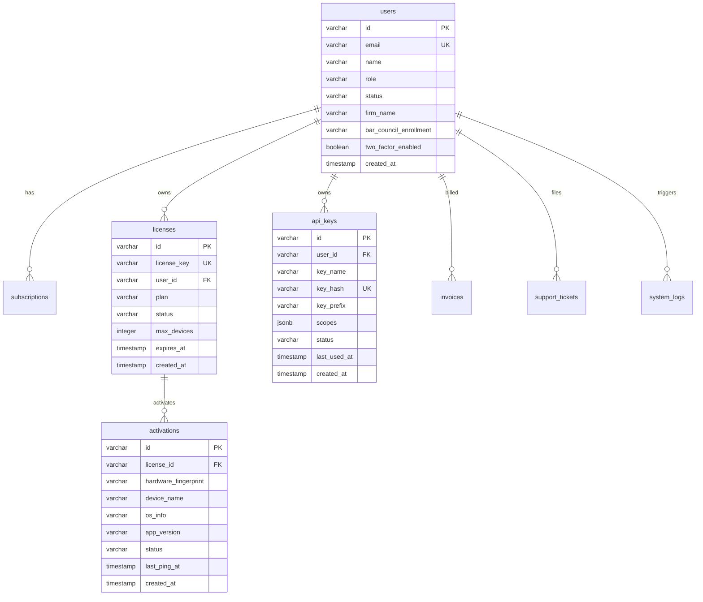

# 02. Database Schema & Data Models

This document defines the complete database schema for the Hayagriva Web Portal & Licensing Server, implemented using **Drizzle ORM** with **Neon Serverless PostgreSQL**.

The schema source file is located at [`admin-panel/src/lib/db/schema.ts`](file:///Users/atulgrover/Desktop/HAYAGRIVA/admin-panel/src/lib/db/schema.ts).

---

## 1. Schema Entity Relationship Diagram



---

## 2. Table Definitions & TypeScript Interfaces

### A. Users Table (`users`)
Stores core identity, profile data, and security status.
- **Role Enum:** `'SUPER_ADMIN' | 'ADVOCATE' | 'SUPPORT_AGENT' | 'VIEWER'`
- **Status Enum:** `'ACTIVE' | 'SUSPENDED' | 'PENDING'`

```typescript
export const users = pgTable('users', {
  id: varchar('id', { length: 64 }).primaryKey(),
  email: varchar('email', { length: 255 }).notNull().unique(),
  name: varchar('name', { length: 255 }).notNull(),
  role: varchar('role', { length: 32 }).notNull().default('ADVOCATE'),
  status: varchar('status', { length: 32 }).notNull().default('ACTIVE'),
  avatarUrl: varchar('avatar_url', { length: 512 }),
  firmName: varchar('firm_name', { length: 255 }),
  barCouncilEnrollment: varchar('bar_council_enrollment', { length: 128 }),
  designation: varchar('designation', { length: 128 }),
  twoFactorEnabled: boolean('two_factor_enabled').default(false),
  createdAt: timestamp('created_at').defaultNow().notNull(),
  updatedAt: timestamp('updated_at').defaultNow().notNull(),
});
```

### B. Licenses Table (`licenses`)
Tracks commercial software entitlements and hardware device capacity quotas.
- **Plan Enum:** `'STARTER' | 'PRO' | 'ENTERPRISE'`
- **Device Limits:** Starter = 1, Pro = 3, Enterprise = 10.

```typescript
export const licenses = pgTable('licenses', {
  id: varchar('id', { length: 64 }).primaryKey(),
  licenseKey: varchar('license_key', { length: 64 }).notNull().unique(),
  userId: varchar('user_id', { length: 64 }).notNull().references(() => users.id),
  plan: varchar('plan', { length: 32 }).notNull().default('PRO'),
  status: varchar('status', { length: 32 }).notNull().default('ACTIVE'), // ACTIVE, SUSPENDED, EXPIRED
  maxDevices: integer('max_devices').notNull().default(3),
  expiresAt: timestamp('expires_at'),
  createdAt: timestamp('created_at').defaultNow().notNull(),
  updatedAt: timestamp('updated_at').defaultNow().notNull(),
});
```

### C. Activations Table (`activations`)
Tracks active physical machines bound to a license key.
- **Unique Constraint:** `(license_id, hardware_fingerprint)` ensures idempotent re-activation without consuming redundant slots.

```typescript
export const activations = pgTable('activations', {
  id: varchar('id', { length: 64 }).primaryKey(),
  licenseId: varchar('license_id', { length: 64 }).notNull().references(() => licenses.id),
  hardwareFingerprint: varchar('hardware_fingerprint', { length: 128 }).notNull(),
  deviceName: varchar('device_name', { length: 255 }).notNull(),
  osInfo: varchar('os_info', { length: 128 }).notNull(),
  appVersion: varchar('app_version', { length: 64 }).notNull(),
  status: varchar('status', { length: 32 }).notNull().default('ACTIVE'), // ACTIVE, DEACTIVATED
  lastPingAt: timestamp('last_ping_at').defaultNow().notNull(),
  createdAt: timestamp('created_at').defaultNow().notNull(),
  updatedAt: timestamp('updated_at').defaultNow().notNull(),
});
```

### D. API Keys Table (`api_keys`)
Stores Cloud MCP Agent bearer token credentials. The full plaintext token (`mcp_live_...`) is only returned to the user upon creation; only the SHA-256 hash is persisted.

```typescript
export const apiKeys = pgTable('api_keys', {
  id: varchar('id', { length: 64 }).primaryKey(),
  userId: varchar('user_id', { length: 64 }).notNull().references(() => users.id),
  keyName: varchar('key_name', { length: 255 }).notNull(),
  keyHash: varchar('key_hash', { length: 128 }).notNull().unique(),
  keyPrefix: varchar('key_prefix', { length: 16 }).notNull(),
  scopes: jsonb('scopes').notNull().$type<string[]>(),
  status: varchar('status', { length: 32 }).notNull().default('ACTIVE'), // ACTIVE, REVOKED
  lastUsedAt: timestamp('last_used_at'),
  createdAt: timestamp('created_at').defaultNow().notNull(),
});
```

### E. Secondary Tables: Subscriptions, Invoices, Logs, Tickets & Releases
- **`subscriptions`:** Tracks plan tier, billing interval (`MONTHLY` / `ANNUAL`), renewal dates, and payment status (`ACTIVE`, `PAST_DUE`, `CANCELED`).
- **`invoices`:** GST invoice ledger, subtotal, tax amount, total amount, and PDF receipt download links.
- **`system_logs`:** Telemetry capturing timestamp, level (`INFO`, `WARN`, `ERROR`), source subsystem (`AUTH`, `LICENSING`, `MCP_GATEWAY`, `VAULT`), user ID, and IP address.
- **`support_tickets`:** Ticket thread tracking with category, priority (`LOW`, `NORMAL`, `HIGH`, `URGENT`), and status (`OPEN`, `IN_PROGRESS`, `RESOLVED`, `CLOSED`).
- **`download_releases`:** Binary repository catalog for desktop builds across platforms (macOS Silicon/Intel, Windows x64, Linux) with SHA-256 checksums and download counts.
