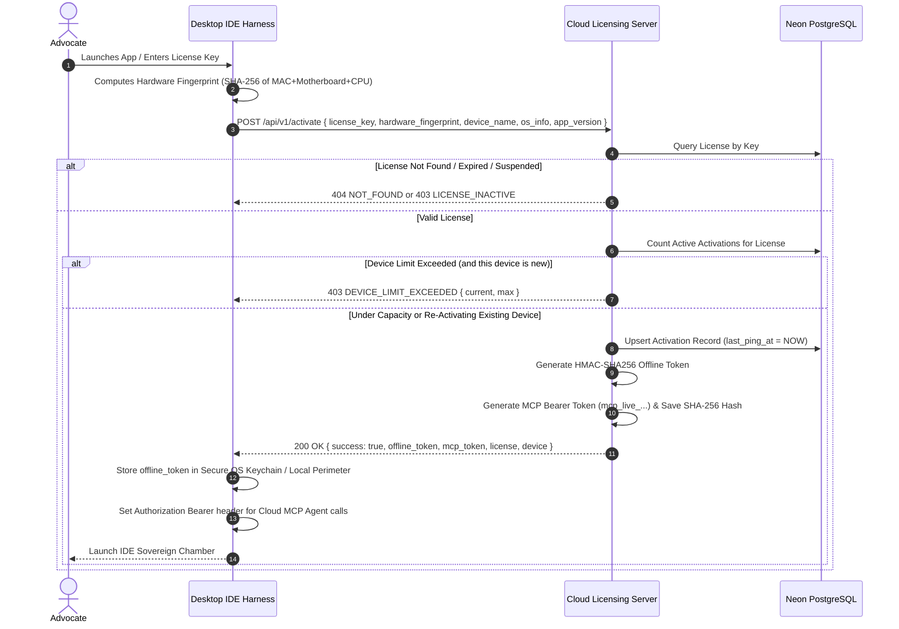

# 03. Licensing Handshake & Cryptographic Protocol

This document specifies the exact protocol implemented by the **Licensing Server (`admin-panel/src/app/api/v1/activate`)** and consumed by the **Desktop IDE Harness (`harness/`)**.

---

## 1. Handshake Flow Diagram



---

## 2. API Endpoint Specifications

### A. Device Activation Handshake: `POST /api/v1/activate`
- **Rate Limit:** 30 requests / min per IP.
- **Request Headers:** `Content-Type: application/json`

#### Request Body:
```json
{
  "license_key": "HAYA-ENT-8F92-K4X9-98QA",
  "hardware_fingerprint": "hw_fp_mac_m3_pro_99824_delhi",
  "device_name": "Adv. Rao Primary MacBook Pro M3",
  "os_info": "macOS 15.1 (Darwin 24.1.0)",
  "app_version": "v1.4.0-sovereign"
}
```

#### Successful Response (`200 OK`):
```json
{
  "success": true,
  "message": "Device successfully activated",
  "offline_token": "eyJsaWNlbnNlS2V5IjoiSEFZQS1FTlQtOEY5Mi1LNFLAG...98QA.8f3a9e...",
  "mcp_token": "mcp_live_8f92k4x998qa771b04a91c2f",
  "license": {
    "key": "HAYA-ENT-8F92-K4X9-98QA",
    "plan": "ENTERPRISE",
    "status": "ACTIVE",
    "expires_at": "2027-10-02T00:00:00.000Z",
    "max_devices": 10,
    "active_devices": 3
  },
  "device": {
    "id": "act_8832",
    "name": "Adv. Rao Primary MacBook Pro M3",
    "last_ping_at": "2026-10-02T16:40:00.000Z"
  }
}
```

#### Failure Responses:
- **`400 BAD_REQUEST`:** Missing required fields (`license_key` or `hardware_fingerprint`).
- **`404 NOT_FOUND`:** `{"error": "INVALID_LICENSE", "message": "The provided license key does not exist"}`.
- **`403 FORBIDDEN`:** `{"error": "LICENSE_SUSPENDED", "message": "This license has been suspended"}`.
- **`403 FORBIDDEN`:** `{"error": "DEVICE_LIMIT_EXCEEDED", "message": "Maximum active devices reached for this license tier (3/3). Please deactivate an existing device from your dashboard."}`.

---

### B. Device Deactivation: `POST /api/v1/deactivate`
Allows practitioners or the desktop app to free up an activation slot.
- **Request Body:**
```json
{
  "license_key": "HAYA-ENT-8F92-K4X9-98QA",
  "hardware_fingerprint": "hw_fp_mac_m3_pro_99824_delhi"
}
```
- **Response (`200 OK`):**
```json
{
  "success": true,
  "message": "Device successfully deactivated",
  "active_devices": 2,
  "max_devices": 10
}
```

---

## 3. Cryptographic Token Specifications

The cryptographic engine is defined in [`admin-panel/src/lib/security/tokens.ts`](file:///Users/atulgrover/Desktop/HAYAGRIVA/admin-panel/src/lib/security/tokens.ts).

### A. Offline Activation Token
- **Format:** `BASE64URL(JSON_PAYLOAD) . HMAC_SHA256_HEX(BASE64URL(JSON_PAYLOAD), SERVER_SECRET)`
- **Payload Structure:**
```typescript
interface OfflineTokenPayload {
  licenseKey: string;
  hardwareFingerprint: string;
  userId: string;
  plan: 'STARTER' | 'PRO' | 'ENTERPRISE';
  issuedAt: number;   // Epoch timestamp (ms)
  expiresAt: number;  // Epoch timestamp (ms) - e.g. 1 year or license expiry
  features: string[]; // ["vault:all", "drafting:unlimited", "ocr:pandoc", "bm25:fts5"]
}
```
- **Air-Gapped Verification in Desktop IDE:**
  The Desktop IDE stores the public verification key (or shared cryptographic signature verifier) to check that:
  1. The signature matches the payload.
  2. `payload.hardwareFingerprint === localMachineFingerprint`.
  3. `payload.expiresAt > Date.now()`.

### B. MCP Cloud Agent Bearer Token
- **Format:** `mcp_live_<32_HEX_RANDOM_BYTES>`
- **Storage Policy:**
  - Plaintext token is generated only once on the server and returned to the client.
  - Server hashes the token via `crypto.createHash('sha256').update(mcp_token).digest('hex')` and stores the hash in `api_keys.key_hash`.
  - Prefix `mcp_live_` (first 12 chars) is stored in `api_keys.key_prefix` for client dashboard display.
- **Default Scopes:** `["mcp:agent:read", "mcp:agent:exec", "mcp:vault:query", "mcp:forensic:inquest"]`.
