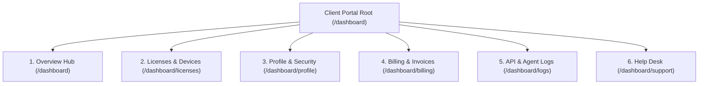

# 04. Client Portal & User Dashboard (`/dashboard/*`)

The **Client Portal** is the dedicated self-service hub for legal practitioners (Advocates, Insolvency Professionals, and Law Firms) subscribed to Hayagriva.

All client routes are authenticated and strictly scoped to the practitioner's `user_id`.

---

## 1. Client Portal Module Architecture

---

## 2. Detailed View Specifications

### A. Practitioner Overview (`/dashboard`)
- **Path:** [`admin-panel/src/app/dashboard/page.tsx`](file:///Users/atulgrover/Desktop/HAYAGRIVA/admin-panel/src/app/dashboard/page.tsx)
- **API Endpoint:** `GET /api/user/overview`
- **Key Metrics & UI Cards:**
  1. **License & Hardware Device Capacity:** Dynamic progress bar showing active physical machines vs. plan limit (e.g. `2 / 10 active devices (20%)`).
  2. **Monthly MCP API Quota:** Progress bar tracking monthly cloud agent token consumption (e.g. `18,420 / 500,000 requests (3.7%)`).
  3. **Subscription Renewal Status:** Plan badge (`ENTERPRISE`), renewal date, and 1-click upgrade button.
  4. **Recent Activity Feed:** Scoped live events (e.g. `Device Activated`, `MCP Key Generated`, `Invoice Paid`).

---

### B. Licenses & Hardware Devices (`/dashboard/licenses`)
- **Path:** [`admin-panel/src/app/dashboard/licenses/page.tsx`](file:///Users/atulgrover/Desktop/HAYAGRIVA/admin-panel/src/app/dashboard/licenses/page.tsx)
- **API Endpoint:** `GET /api/user/licenses` & `POST /api/v1/deactivate`
- **Key Features:**
  1. **License Key Masking & Copy:** Shows masked key `••••••••••••` by default with toggle to reveal plaintext and 1-click clipboard copy.
  2. **Hardware Activations Table:** TanStack table listing device name, OS version, app version, last ping timestamp, and active status.
  3. **1-Click Device Slot Deactivation Modal:** [`deactivate-modal.tsx`](file:///Users/atulgrover/Desktop/HAYAGRIVA/admin-panel/src/components/client/deactivate-modal.tsx) allows users to decommission old machines and immediately free up a hardware slot.
  4. **Desktop Installers Download Row:** Direct download pills for macOS Apple Silicon, macOS Intel, Windows x64, and Linux `.AppImage`.

---

### C. Profile, Security & MCP API Keys (`/dashboard/profile`)
- **Path:** [`admin-panel/src/app/dashboard/profile/page.tsx`](file:///Users/atulgrover/Desktop/HAYAGRIVA/admin-panel/src/app/dashboard/profile/page.tsx)
- **API Endpoints:** `GET /api/user/profile`, `PUT /api/user/profile`, `GET/POST/DELETE /api/user/keys`
- **Key Features:**
  1. **Locked Email Guard:** Email is displayed with a `🔒 IMMUTABLE` badge. Client forms reject any attempt to modify email to protect account ownership.
  2. **Practice Profile Fields:** Edit Law Firm Name, Designation, and Bar Council Enrollment Number.
  3. **Two-Factor Authentication (2FA):** Toggle switch for TOTP authenticator app enforcement.
  4. **Cloud MCP Agent API Key Generator:** [`generate-key-modal.tsx`](file:///Users/atulgrover/Desktop/HAYAGRIVA/admin-panel/src/components/client/generate-key-modal.tsx) enables practitioners to generate scoped `mcp_live_...` bearer keys with instant secret copy.

---

### D. Billing & Invoices (`/dashboard/billing`)
- **Path:** [`admin-panel/src/app/dashboard/billing/page.tsx`](file:///Users/atulgrover/Desktop/HAYAGRIVA/admin-panel/src/app/dashboard/billing/page.tsx)
- **API Endpoint:** `GET /api/user/invoices`
- **Key Features:**
  1. **Active Plan Card:** Displays tier, pricing interval (Annual/Monthly), next billing date, and payment method on file (e.g. `Mastercard ending in 8831`).
  2. **Tax Invoice History:** Table displaying invoice ID, date, subtotal, 18% GST calculation, total INR amount, and 1-click **Download PDF** receipt button.

---

### E. API & Agent Execution Logs (`/dashboard/logs`)
- **Path:** [`admin-panel/src/app/dashboard/logs/page.tsx`](file:///Users/atulgrover/Desktop/HAYAGRIVA/admin-panel/src/app/dashboard/logs/page.tsx)
- **API Endpoint:** `GET /api/user/logs`
- **Key Features:**
  1. **Live Request Stream:** Scoped list of recent MCP agent calls, token verifications, and vault queries.
  2. **Telemetry Metadata:** HTTP method badge (`POST`, `GET`), endpoint URL, IP address, latency (e.g. `42ms`), and HTTP status pill (`200 OK`, `403 FORBIDDEN`).

---

### F. Support & Help Desk (`/dashboard/support`)
- **Path:** [`admin-panel/src/app/dashboard/support/page.tsx`](file:///Users/atulgrover/Desktop/HAYAGRIVA/admin-panel/src/app/dashboard/support/page.tsx)
- **API Endpoint:** `GET/POST /api/user/support`
- **Key Features:**
  1. **Ticket Threads:** Displays active and resolved support inquiries with priority pills (`LOW`, `NORMAL`, `HIGH`, `URGENT`) and status badges.
  2. **Create Ticket Drawer:** [`create-ticket-modal.tsx`](file:///Users/atulgrover/Desktop/HAYAGRIVA/admin-panel/src/components/client/create-ticket-modal.tsx) for submitting technical, billing, or feature inquiries directly to the support desk.
