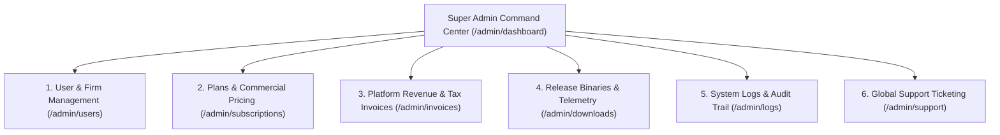

# 05. Super Admin Control Panel (`/admin/*`)

The **Super Admin Control Panel** is the executive nerve center for Hayagriva platform operators. It is strictly gated by Edge Middleware to users possessing the `SUPER_ADMIN` role.

---

## 1. Super Admin Architecture & Role-Based Access Control

- **Role Requirement:** `users.role === 'SUPER_ADMIN'`
- **Unauthorized Handling:** Any non-admin attempting to access `/admin/*` or `/api/admin/*` receives a `403 Forbidden` response.
- **Root Route:** [`admin-panel/src/app/admin/dashboard/page.tsx`](file:///Users/atulgrover/Desktop/HAYAGRIVA/admin-panel/src/app/admin/dashboard/page.tsx)

---

## 2. Admin Modules Overview

---

## 3. Detailed Admin Capabilities

### A. User Management & Slide-Over Drawer (`/admin/users`)
- **Interactive Data Table:** Filter and sort practitioners by Name, Email, Firm, Role, Subscription Tier, and Status (`ACTIVE`, `SUSPENDED`, `PENDING`).
- **User Detail Drawer:** Displays deep profile metadata, registered hardware devices, active license keys, and API key count.
- **Admin Actions:**
  - **Edit User Profile:** Update firm name, designation, and Bar Council ID.
  - **Administrative Password Reset:** Generates a secure temporary password or sends a magic reset link.
  - **Account Status Toggle:** Instantly suspend or reactivate an account.

### B. Subscriptions & Tier Management (`/admin/subscriptions`)
- **Commercial Plans:** Configure features and device slot limits for `STARTER`, `PRO`, and `ENTERPRISE` tiers.
- **Practitioner Overrides:** Manually upgrade/downgrade client plans, extend trial periods, or issue custom enterprise device slot quotas.

### C. Invoices & Revenue Ledger (`/admin/invoices`)
- **Global Financial Dashboard:** Tracks Gross Merchandise Value (GMV), Monthly Recurring Revenue (MRR), and GST compliance filings.
- **Invoice Audit:** View and download signed GST tax invoices for any transaction across all law firms.

### D. Binary Releases & Desktop Telemetry (`/admin/downloads`)
- **Desktop Build Management:** Upload and publish new versions of the Theia Desktop IDE (macOS `.dmg`, Windows `.exe`/`.msi`, Linux `.deb`/`.AppImage`).
- **Checksum Verification:** Generates and verifies SHA-256 binary checksums for client tamper-proofing.
- **Platform Telemetry:** Visual download distributions across OS architectures.

### E. System Logs & Global Audit Trail (`/admin/logs`)
- **Immutable Log Stream:** Centralized log viewer aggregating authentication events, license activations, failed password attempts, and cloud agent MCP calls across all tenants.
- **Filtering & Search:** Real-time search by severity (`INFO`, `WARN`, `ERROR`), source subsystem, IP address, or user ID.

### F. Global Support Desk (`/admin/support`)
- **Ticket Queue:** Manage customer support tickets across all practitioners.
- **Staff Assignment & Resolution:** Assign tickets to internal legal/tech support engineers, change status, and post responses.
