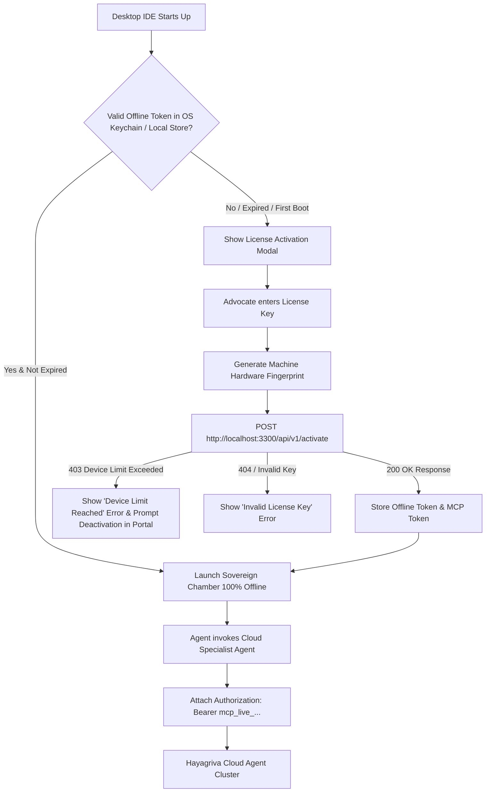

# 06. Harness Desktop Integration Guide

This guide explains how the **Desktop IDE Harness (`harness/`)** interacts with the **Licensing Server & Web Portal (`admin-panel/`)** to manage authentication, offline licensing tokens, hardware fingerprinting, and Cloud MCP Agent bearer authentication.

---

## 1. Desktop IDE Architecture & Lifecycle

The Desktop IDE Harness is built on Eclipse Theia and Node.js. It operates with a **Local-First, Air-Gapped Philosophy**.



---

## 2. Hardware Fingerprint Generation in Node.js

The desktop harness calculates a deterministic, immutable hardware fingerprint based on system hardware components (MAC address, CPU serial/model, and motherboard UUID):

```javascript
// harness/backend/lib/security/hardware-fingerprint.js
const crypto = require('crypto');
const os = require('os');

function getHardwareFingerprint() {
  const networkInterfaces = os.networkInterfaces();
  let macAddresses = [];

  for (const name of Object.keys(networkInterfaces)) {
    for (const net of networkInterfaces[name]) {
      if (!net.internal && net.mac && net.mac !== '00:00:00:00:00:00') {
        macAddresses.push(net.mac);
      }
    }
  }
  macAddresses.sort();

  const rawFingerprint = [
    os.platform(),
    os.arch(),
    os.cpus()[0]?.model || 'generic_cpu',
    os.hostname(),
    macAddresses.join(';')
  ].join('|');

  return 'hw_' + crypto.createHash('sha256').update(rawFingerprint).digest('hex').substring(0, 32);
}

module.exports = { getHardwareFingerprint };
```

---

## 3. The Desktop Client Handshake Implementation

The core client-side activation routine in the Desktop Harness backend:

```javascript
// harness/backend/lib/core/auth-service.js (or licensing client)
const fs = require('fs');
const path = require('path');
const { getHardwareFingerprint } = require('../security/hardware-fingerprint');

const LICENSING_SERVER_URL = process.env.HAYA_LICENSING_SERVER || 'http://localhost:3300';
const LOCAL_CREDENTIALS_FILE = path.join(process.env.HOME || process.env.USERPROFILE, '.hayagriva', 'credentials.json');

async function activateLicenseKey(licenseKey, deviceName = 'Primary Workstation') {
  const hardwareFingerprint = getHardwareFingerprint();
  const osInfo = `${process.platform} (${process.arch})`;
  const appVersion = require('../../../package.json').version || 'v1.4.0';

  const response = await fetch(`${LICENSING_SERVER_URL}/api/v1/activate`, {
    method: 'POST',
    headers: { 'Content-Type': 'application/json' },
    body: JSON.stringify({
      license_key: licenseKey,
      hardware_fingerprint: hardwareFingerprint,
      device_name: deviceName,
      os_info: osInfo,
      app_version: appVersion,
    }),
  });

  const data = await response.json();

  if (!response.ok) {
    const error = new Error(data.message || 'Activation failed');
    error.code = data.error || 'ACTIVATION_FAILED';
    throw error;
  }

  // Save the tokens locally in secure directory
  fs.mkdirSync(path.dirname(LOCAL_CREDENTIALS_FILE), { recursive: true });
  fs.writeFileSync(LOCAL_CREDENTIALS_FILE, JSON.stringify({
    license_key: licenseKey,
    hardware_fingerprint: hardwareFingerprint,
    offline_token: data.offline_token,
    mcp_token: data.mcp_token,
    license: data.license,
    activated_at: new Date().toISOString(),
  }, null, 2), { mode: 0o600 }); // strict file permissions

  return data;
}

module.exports = { activateLicenseKey, LOCAL_CREDENTIALS_FILE };
```

---

## 4. Offline Token Verification (Zero Network Required)

Once activated, the Desktop IDE verifies the cached offline token on every boot without making any network calls:

```javascript
// harness/backend/lib/security/offline-verifier.js
const crypto = require('crypto');
const { getHardwareFingerprint } = require('./hardware-fingerprint');

// Public verification secret or asymmetric public key bundled in the binary
const SERVER_SIGNING_SECRET = process.env.HAYA_OFFLINE_SECRET || 'hayagriva_offline_token_hmac_secret_key_2026';

function verifyLocalOfflineToken(offlineToken) {
  if (!offlineToken || typeof offlineToken !== 'string') {
    return { valid: false, reason: 'TOKEN_MISSING' };
  }

  const [b64Payload, signature] = offlineToken.split('.');
  if (!b64Payload || !signature) {
    return { valid: false, reason: 'MALFORMED_TOKEN' };
  }

  // 1. Verify HMAC signature
  const expectedSignature = crypto
    .createHmac('sha256', SERVER_SIGNING_SECRET)
    .update(b64Payload)
    .digest('hex');

  if (signature !== expectedSignature) {
    return { valid: false, reason: 'TAMPERED_SIGNATURE' };
  }

  // 2. Parse payload
  let payload;
  try {
    payload = JSON.parse(Buffer.from(b64Payload, 'base64url').toString('utf8'));
  } catch {
    return { valid: false, reason: 'INVALID_JSON_PAYLOAD' };
  }

  // 3. Verify hardware binding
  const currentHardwareFingerprint = getHardwareFingerprint();
  if (payload.hardwareFingerprint !== currentHardwareFingerprint) {
    return { valid: false, reason: 'HARDWARE_MISMATCH', payload };
  }

  // 4. Verify expiration
  if (payload.expiresAt && payload.expiresAt < Date.now()) {
    return { valid: false, reason: 'TOKEN_EXPIRED', payload };
  }

  return { valid: true, payload };
}

module.exports = { verifyLocalOfflineToken };
```

---

## 5. Attaching the MCP Bearer Token to Cloud Agent Calls

When a local subagent (Advisor Agent, Forms Agent, Document Agent) requires remote intelligence (e.g. cross-registry conflict inquest or MCA charge checking), it attaches the stored `mcp_token`:

```javascript
// harness/backend/lib/seams/cloud-mcp-client.js
const fs = require('fs');
const { LOCAL_CREDENTIALS_FILE } = require('../core/auth-service');

async function callCloudMcpTool(toolName, parameters) {
  if (!fs.existsSync(LOCAL_CREDENTIALS_FILE)) {
    throw new Error('Desktop IDE is not activated. Please activate your license to use Cloud MCP tools.');
  }

  const creds = JSON.parse(fs.readFileSync(LOCAL_CREDENTIALS_FILE, 'utf8'));
  const mcpToken = creds.mcp_token;

  const CLOUD_MCP_GATEWAY = process.env.HAYA_MCP_GATEWAY || 'https://api.hayagriva.app/v1/mcp';

  const response = await fetch(`${CLOUD_MCP_GATEWAY}/tools/call`, {
    method: 'POST',
    headers: {
      'Content-Type': 'application/json',
      'Authorization': `Bearer ${mcpToken}`,
    },
    body: JSON.stringify({
      tool: toolName,
      params: parameters,
      license_key: creds.license_key,
    }),
  });

  if (!response.ok) {
    const err = await response.json();
    throw new Error(`Cloud MCP Error (${response.status}): ${err.message}`);
  }

  return await response.json();
}

module.exports = { callCloudMcpTool };
```

---

## 6. Self-Service Deactivation & Re-hosting

If a practitioner migrates to a new laptop:
1. In the Web Portal (`/dashboard/licenses`), they click **Deactivate** next to the old laptop.
2. The server marks the device as `DEACTIVATED` in `activations`, freeing up one slot.
3. On the new laptop, entering the license key triggers `POST /api/v1/activate` with the new hardware fingerprint.
4. The server sees available slots $\rightarrow$ activates the new laptop immediately.
