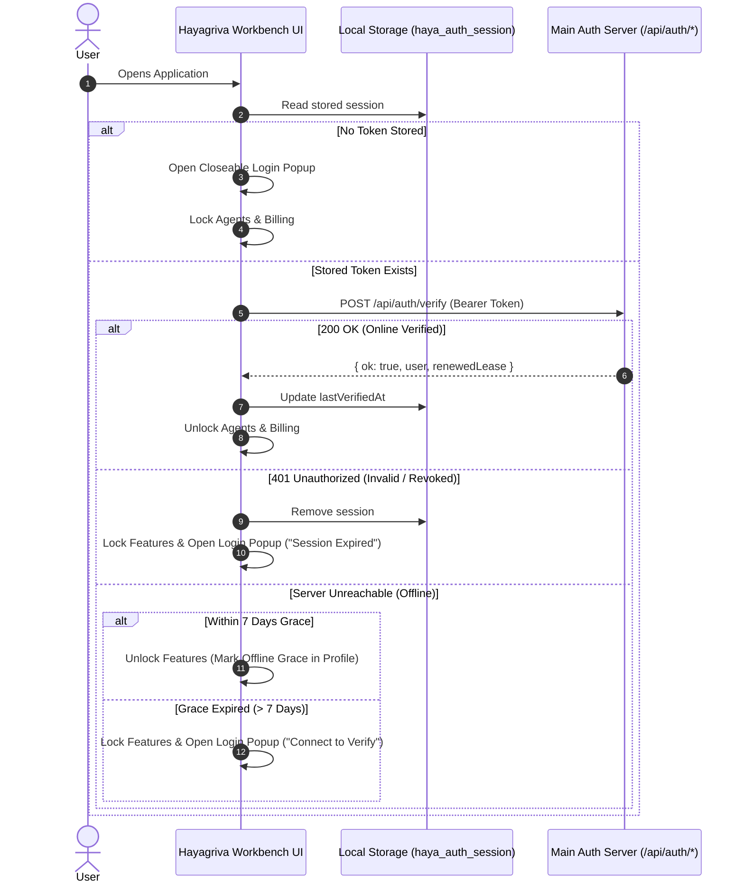

# Specification: User Authentication, Profile Management & Feature Gating

- **Date:** 2026-10-02
- **Status:** Approved for Implementation Planning
- **Component Scope:** Frontend (`theia-extensions/hayagriva`), Backend API (`backend/lib/routes.js`, `backend/lib/api-server.js`), Auth Store (`backend/lib/core/auth-service.js`)

---

## 1. Executive Summary

This specification establishes an end-to-end authentication and feature-gating subsystem for Hayagriva Sovereign Legal Workbench. It enables users to authenticate with a central server, maintains local session tokens with offline grace-period resilience, provides a profile management UI in the bottom left activity bar, and conditionally protects premium capabilities (**Hayagriva Autonomous Agents** and **Estate Accounts & Billing**) while keeping core document editing, navigation, and viewing completely open and accessible.

---

## 2. Core Architecture & Authentication Flow

### 2.1 State & Token Lifecycle
1. **Startup Check (`onStart`):**
   - The workbench reads `haya_auth_session` from `localStorage` (containing `token`, `user`, `lastVerifiedAt`, `leaseExpiresAt`).
   - If a token is found, an asynchronous verification call is dispatched to `POST /api/auth/verify`.
   - **Online Validation:** If verified (HTTP 200), `lastVerifiedAt` is updated, and all premium features are unlocked.
   - **Offline Grace Period:** If the server is unreachable, the system checks if `(Date.now() - lastVerifiedAt) <= 7 Days`. If valid, the session remains active in offline mode with a visual indicator.
   - **Expired / No Session:** If no token is found, or the 7-day grace period has lapsed, the session is cleared and the closeable login popup is shown.
2. **Login Process:**
   - User inputs email and password into the login popup.
   - Frontend issues `POST /api/auth/login`.
   - On success, the backend returns a signed JWT token, user profile, and lease expiration.
   - The session is saved to `localStorage`, the popup closes, the profile icon updates to the user's avatar/initials, and gated features are unlocked.
3. **Logout Process:**
   - User clicks the Profile Icon and selects **"Sign Out"**.
   - Optional `POST /api/auth/logout` is sent to the server.
   - `localStorage` is purged of auth credentials.
   - Premium features (Agents & Billing) are immediately locked.
   - Profile icon transitions to the logged-out state.



---

## 3. API Endpoints Specification

### 3.1 `POST /api/auth/login`
- **Request Body:**
  ```json
  {
    "email": "lawyer@chamber.in",
    "password": "SecurePassword123"
  }
  ```
- **Response (200 OK):**
  ```json
  {
    "ok": true,
    "token": "eyJhbGciOiJIUzI1NiIsInR5cCI6IkpXVCJ9...",
    "user": {
      "id": "usr_94827",
      "name": "Adv. Atul Grover",
      "email": "lawyer@chamber.in",
      "org": "Grover & Associates Chambers",
      "tier": "enterprise"
    },
    "leaseExpiresAt": "2026-10-09T15:30:00.000Z"
  }
  ```
- **Response (401 Unauthorized):**
  ```json
  {
    "ok": false,
    "error": "Invalid email or password."
  }
  ```

### 3.2 `POST /api/auth/verify`
- **Headers:** `Authorization: Bearer <token>`
- **Response (200 OK):**
  ```json
  {
    "ok": true,
    "user": {
      "id": "usr_94827",
      "name": "Adv. Atul Grover",
      "email": "lawyer@chamber.in",
      "org": "Grover & Associates Chambers",
      "tier": "enterprise"
    },
    "verifiedAt": "2026-10-02T15:40:00.000Z",
    "leaseExpiresAt": "2026-10-09T15:40:00.000Z"
  }
  ```
- **Response (401 Unauthorized):**
  ```json
  {
    "ok": false,
    "error": "Session expired or revoked."
  }
  ```

### 3.3 `POST /api/auth/logout`
- **Headers:** `Authorization: Bearer <token>`
- **Response (200 OK):**
  ```json
  {
    "ok": true,
    "message": "Session invalidated."
  }
  ```

---

## 4. User Interface Specifications

### 4.1 Profile Icon & Account Popover
- **Placement:** Docked at the bottom of the Left Activity Bar (below Settings gear).
- **Logged-Out State:**
  - Silhouette user icon (`👤`) with subtle indicator.
  - Tooltip: `"Account: Not Logged In (Click to Sign In)"`.
  - On click: Opens the **Login Popup**.
- **Logged-In State:**
  - Circle avatar displaying user initials (`AG`) with a status pip (green for online, orange for offline grace period).
  - Tooltip: `"Account: Adv. Atul Grover"`.
  - On click: Opens the **Account Popover Card**:
    - User display name and email.
    - Organization and membership tier.
    - Connection/lease status (`"● Verified (Online)"` or `"● Offline Grace (6 days left)"`).
    - **"Sign Out"** button.

### 4.2 Closeable Login Popup (`#hayagriva-auth-gate`)
- **Visual Style:** Glassmorphic centered dialog overlay (`backdrop-filter: blur(12px)`).
- **Controls:**
  - Header with Hayagriva Stallion gold emblem and title: *"Sign In to Link Main Server"*.
  - **`✖` Dismiss Button** in top right (or `Escape` key) to close the popup.
  - Email input with autofocus and validation.
  - Password input with toggleable visibility.
  - Primary button: `"Sign In"` (with spinner during network requests).
  - Error alert block for invalid credentials or network errors.
  - Footnote: *"Browsing, editing, and reading local documents is always open. Signing in unlocks Hayagriva AI Agents and Estate Accounts & Billing."*

---

## 5. Feature Gating & Permissions

### 5.1 Open Features (No Login Required)
- **Documents Navigator:** File tree, directory creation, file opening, renaming, deleting.
- **Monaco Editor:** Syntax highlighting, code editing, law section autocompletions.
- **File Previews:** Companion markdown live view, Office/PDF viewer, search across local files.

### 5.2 Gated Features (Login Strictly Required)
- **Hayagriva AI Agents (Pillar 3 & AskHaya Voice Orb):**
  - When logged out, the Agents tab displays a locked state with an inline prompt: *"Sign In Required to Activate AI Agents"* along with a `"Sign In"` action button.
  - Chat agent commands (`@AskHaya`, `@FormsAgent`, `@DocumentAgent`) and floating orb voice interactions are suppressed until authenticated.
- **Estate Accounts & Billing (Pillar 5):**
  - When logged out, the Estate Accounts tab displays a locked status card or remains suppressed from the activity bar.
  - Backend billing endpoints (`/api/hayagriva/billing/*`) return `401 Unauthorized` without a valid bearer token.

---

## 6. Verification & Automated Testing Plan

### 6.1 Backend Test Cases (`backend/tests/test_auth_routes.test.js`)
1. **Authentication Flow:**
   - Valid credentials return 200 with JWT, user object, and expiration.
   - Invalid password returns 401 with standard error structure.
   - Missing fields return 400 Bad Request.
2. **Token Verification:**
   - Valid token returns 200 with user profile and refreshed timestamp.
   - Expired or malformed token returns 401.
3. **Route Authorization Guard:**
   - Requests to `/api/hayagriva/billing/summary` without token return 401.
   - Requests to `/api/hayagriva/billing/summary` with valid token return 200.

### 6.2 Frontend Browser/Puppeteer Integration Tests
1. **Initial Unauthenticated Boot:**
   - Open app without token -> verify login popup appears.
   - Close login popup -> verify documents explorer and Monaco editor are interactive.
   - Verify Hayagriva Agents and Estate Accounts show locked status.
2. **Login & Feature Unlock:**
   - Open login popup via Profile Icon -> enter valid credentials -> submit.
   - Verify modal closes, Profile Icon shows initials `AG`, Agents and Estate Accounts become enabled.
3. **Logout & Relock:**
   - Click Profile Icon -> click "Sign Out".
   - Verify session is removed, features are re-locked, and Profile Icon returns to logged-out state.
4. **Offline Grace Mode:**
   - Store valid session with recent `lastVerifiedAt` -> simulate server offline.
   - Boot app -> verify features remain unlocked and Profile popover indicates "Offline Grace".
