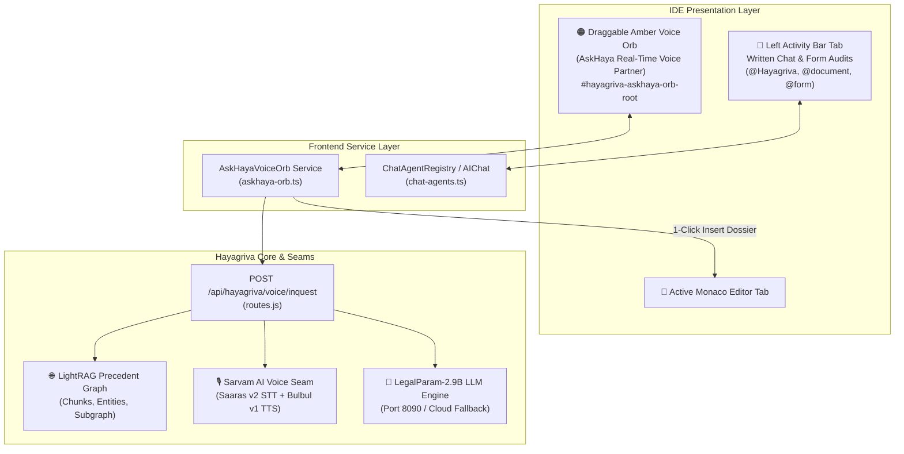

# Design Specification: Ambient Amber Voice Orb (AskHaya)

**Date:** 2026-10-03  
**Status:** Approved  
**Topic:** Sovereign Ambient Voice Precedent Partner & Workspace Orb  

---

## 1. Executive Summary & Purpose

In the current workspace, AskHaya (the live voice inquest agent connected to the LightRAG knowledge graph) was colocated within the general AI Agents chat panel on the left activity bar. This created cognitive friction between two fundamentally different modes of work:
1. **Written Structural Drafting & Audits:** Handled by specialized coworkers (`@Hayagriva`, `@document`, `@form`, `@advisor`, `@bank-forensic`) inside the left activity bar tab panel.
2. **Ambient Oral Precedent Inquests:** Handled by **AskHaya**, a real-time conversational voice partner that searches authoritative judicial precedents, speaks concise legal analyses via Sarvam AI, and generates Court-ready citation dossiers.

This specification formalizes the separation:
- The **Left Activity Bar Stallion Tab** remains the **Written AI Agents & Drafting Workspace**.
- **AskHaya** is extracted into an **Ambient Draggable Amber Voice Orb** (`#hayagriva-askhaya-orb-root`) that floats non-intrusively across the IDE with in-place fluid expansion across 4 interactive states (`idle`, `listening`, `processing`, `speaking`).

---

## 2. Component Architecture & Data Flow

---

## 3. The 4 Interactive Orb States

The Orb expands and contracts **in-place** at its current screen coordinates without moving or disrupting the active editor view.

| State | Visual Language & Dimensions | Controls & Indicators |
|---|---|---|
| **1. Idle** | **44px × 44px** frosted glass circle. • Amber glowing border (`rgba(245, 158, 11, 0.6)`) • Gold horse emblem glyph • Subtle breathing glow pulse (`hayaOrbBreathe`) | • Draggable anywhere via mouse pointer. • Position saved in `localStorage` (`haya_voice_orb_pos`). • Click to start listening. • Global hotkey: `Alt+Space`. |
| **2. Listening** | **280px × 80px** fluid glassmorphic capsule. • Real-time 5-bar amber audio waveform animation. • Live partial STT transcription display. • Glowing red/amber mic recording pip. | • Push-to-talk click or `Alt+Space`. • Automatic silence endpointing (~1.5s). • Checkmark (submit) & Cancel (X) buttons. • Fallback inline text query field. |
| **3. Processing** | **280px × 74px** glassmorphic capsule. • Rotating amber neural radar shimmer. • Status: *"Querying LightRAG Precedents..."* | • Asynchronous retrieval from LightRAG knowledge graph. • LegalParam statutory reasoning synthesis. • Non-blocking cancel button. |
| **4. Speaking** | **320px × 110px** glassmorphic dossier card. • Dynamic audio playback wave. • Streaming spoken legal synthesis text. • Audio playback via Sarvam Bulbul v1 (or browser speech synthesis fallback). | • **Instant Barge-in:** Clicking anywhere interrupts audio immediately. • **`📋 Insert into Editor`** CTA button. • **`📖 View Full Dossier`** preview CTA. |

---

## 4. Interaction Ergonomics & Draggability

1. **Draggable Physics & Bounds:**
   - Mouse down on the outer rim of the Orb allows seamless dragging anywhere across the screen.
   - Constrained to `window.innerWidth - width - 8px` and `window.innerHeight - height - 32px` (ensuring it never overlaps the bottom status bar).
   - Coordinate persistence: Stored in `localStorage.getItem('haya_voice_orb_pos')` and re-hydrated on IDE startup.
2. **Keyboard Shortcut (`Alt+Space`):**
   - Pressing `Alt+Space` from any active editor or sidebar instantly activates the Orb in listening mode without requiring mouse movement.
3. **Quiet Chamber Fallback (Micro Text Prompt):**
   - When in libraries, courtrooms, or noisy environments, clicking the small pencil icon in the expanded capsule reveals an inline input for typing a quick precedent query.
4. **Air-Gapped Lite Mode Compatibility:**
   - In 100% offline Lite Mode (port 8090/9621 inactive), the Orb automatically cascades to browser Web Speech Recognition + Web SpeechSynthesis + local bare act vault search with 0 compute overhead.

---

## 5. File Structure & Changes

### 1. `frontend/theia-extensions/hayagriva/src/browser/askhaya-orb.ts`
- Implement complete in-place DOM rendering and style injection for `#hayagriva-askhaya-orb-root`.
- Implement draggability physics with viewport constraints and `localStorage` persistence.
- Implement state machine transitions (`idle` $\rightarrow$ `listening` $\rightarrow$ `processing` $\rightarrow$ `speaking` $\rightarrow$ `idle`).
- Implement audio waveform canvas / CSS bars, Web Speech / Sarvam API audio streaming, and barge-in audio interruption.
- Implement Monaco Editor insertion bridge via `EditorManager.currentEditor`.

### 2. `frontend/theia-extensions/hayagriva/src/browser/extension.ts`
- Ensure `AskHayaVoiceOrb.initialize()` is called on frontend startup to mount the floating Orb.
- Retain the left Activity Bar Stallion tab (`chat-view-widget`) for multi-agent written drafting without disruption.

### 3. `backend/lib/routes.js` & `backend/lib/agents/lightrag-voice-agent.js`
- Connect voice inquest requests to existing endpoints `POST /api/hayagriva/voice/inquest` and `POST /api/hayagriva/voice/tts`.

### 4. Tests
- Create `backend/tests/test_askhaya_voice_orb.test.js` validating the state transitions, endpoint contracts, Lite Mode fallbacks, and DOM structure.

---

## 6. Verification & Acceptance Criteria

1. **Idle Render:** Ambient 44px frosted amber circle visible on screen, draggable, and persistent across page reloads.
2. **Left Panel Independence:** Left Activity Bar Stallion tab remains fully functional for standard text AI agent conversations.
3. **In-Place Expansion:** Clicking the Orb expands it smoothly into the listening capsule at its current `(x, y)` location.
4. **Precedent Synthesis:** Submitting a voice query queries LightRAG, renders spoken legal advice, and provides the `[📋 Insert into Editor]` action.
5. **Zero Status Bar Collisions:** Position constraints keep the Orb clear of the bottom status bar and top menu.
