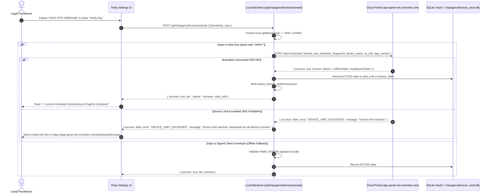

# Design Specification: Sovereign Licensing Bridge & Gating Engine

**Document ID:** SPEC-2026-10-03-LICENSING-GATE  
**Author:** Antigravity / DeepMind Pair Programming  
**Status:** Approved for Implementation Planning  
**Target Systems:**
1. **Web Portal & Licensing Cloud:** `https://app-apnet-net.onrender.com` (Next.js 15, Neon PostgreSQL)
2. **Harness Desktop IDE:** `harness/` (Theia IDE, Node.js SQLite License Vault)
3. **Marketing Website:** `agentic_professionals_website/` (HTML/JS Landing)

---

## 1. Executive Summary & Goals

This specification formalizes the end-to-end licensing architecture enabling hundreds of legal practitioners to register on the Agentic Professionals Web Portal, receive their license credentials, and activate the Hayagriva Desktop IDE across macOS, Windows, and Linux machines.

### Key Objectives:
1. **Zero Friction Activation:** A user copies a raw license key (`HAYA-STR-...`, `HAYA-PRO-...`) from the web portal dashboard and pastes it into the Desktop IDE Settings. The IDE performs an automated online activation handshake and unlocks autonomous agents in <500ms.
2. **Air-Gapped Sovereign Enforcement:** Once activated, the desktop IDE functions 100% offline without continuous telemetry pings or network dependencies. An offline license file / token envelope fallback allows manual activation in completely air-gapped chambers.
3. **Core Workbench Immunity:** Unactivated installs enjoy full lifetime access to basic document ingestion, PDF parsing, FTS5 local search, Monaco editor, and PageIndex tree browsing for free, while gating heavy autonomous AI agent drafting (`@Advisor`, `@Forms`, `@Document`) and bare act statutory vaults.
4. **Hardware-Locked Anti-Piracy:** Licenses are bound to machine hardware fingerprints (`MAC-...`, `WIN-...`, `NIX-...`) with multi-device slot tracking and self-service device deactivation via the web portal.

---

## 2. System Architecture & Data Flow

```
┌────────────────────────────────────────────────────────┐
│             AGENTIC PROFESSIONALS WEB PORTAL           │
│           (https://app-apnet-net.onrender.com)         │
│                                                        │
│  1. User Registers -> Auto-generates HAYA-STR-xxxx     │
│  2. User views License Key in /dashboard/licenses      │
│  3. Exposes POST /api/v1/activate & /deactivate        │
│  4. Stores activations in Neon PostgreSQL              │
└───────────────────────────┬────────────────────────────┘
                            │
               1. Copy Key  │  2. Automatic HTTPS Handshake
               (User action)│     POST /api/v1/activate
                            ▼
┌────────────────────────────────────────────────────────┐
│                  HAYAGRIVA DESKTOP HARNESS             │
│                                                        │
│  • Settings Cockpit (tabPanelLicense)                  │
│  • Backend Bridge: POST /api/hayagriva/license/activate│
│  • Hardware Fingerprint: machine-fingerprint.js        │
│  • SQLite Vault: ~/.hayagriva/license_vault.db         │
│  • Entitlements: ~/.hayagriva/active_license_entitlements│
│  • Gate Interceptors: checkAgentAccess()               │
└────────────────────────────────────────────────────────┘
```

---

## 3. Cryptographic Token & Payload Specification

### 3.1 Shared Secret Configuration
Both the cloud portal and the desktop IDE backend use a synchronized HMAC-SHA256 signing secret:
* **Environment Variable:** `HAYAGRIVA_LICENSE_SECRET`
* **Default Fallback:** `hayagriva_sovereign_chamber_secret_key_2026`

### 3.2 Token Envelope Format
A signed token envelope consists of two or three parts:
```
HAYG.<base64url(payload)>.<base64url(signature)>
```
or
```
<base64url(payload)>.<base64url(signature)>
```

### 3.3 Payload Schema
```json
{
  "sub": "advocate@chambers.in",
  "licenseKey": "HAYA-STR-7B9E2K4M",
  "hardwareFingerprint": "MAC-A1B2C3D4E5F67890",
  "tier": "starter",
  "allowed_packs": [
    "suite_cirp",
    "suite_finance",
    "suite_liquidation",
    "suite_msme",
    "suite_guarantor",
    "suite_litigation"
  ],
  "issued_at": "2026-10-03T04:25:00.000Z",
  "valid_until": "2027-10-03T04:25:00.000Z",
  "max_active_hours": 150,
  "max_agent_turns": 1000
}
```

---

## 4. End-to-End Activation Sequence



---

## 5. Gating Policy Matrix

| System Component | Unactivated (Free Core) | Starter (`HAYA-STR-...`) | Professional (`HAYA-PRO-...`) | Enterprise (`HAYA-ENT-...`) |
| :--- | :--- | :--- | :--- | :--- |
| **Document Ingestion (PDF, Word, Excel)** | Full (Free Forever) | Full | Full | Full |
| **FTS5 & Vector Search** | Full (Free Forever) | Full | Full | Full |
| **Monaco Code & Markdown Editor** | Full (Free Forever) | Full | Full | Full |
| **PageIndex Hierarchy Tree** | Full (Free Forever) | Full | Full | Full |
| **Bare Act Statutory Vaults** | Restricted | Unlocked | Unlocked | Unlocked |
| **@Advisor Agent (Merits & Scoring)** | Gated | Unlocked | Unlocked | Unlocked |
| **@Forms Agent (Statutory Forms)** | Gated | Unlocked | Unlocked | Unlocked |
| **@Document Agent (Pleadings Drafter)**| Gated | Unlocked | Unlocked | Unlocked |
| **Forensic Bank Ledger Analyzer** | Gated | Gated | Unlocked | Unlocked |
| **Active Devices per Seat** | N/A | 1 Device | 3 Devices | Unlimited / Multi-seat |

---

## 6. Frontend UI Specifications

### 6.1 Settings Cockpit — License Tab (`#tabPanelLicense`)
1. **Statutory Identity & Hardware Anchor Header:**
   - Displays User's Name, IBBI Registration, Enrolment, and Verified Master Email.
   - Workstation Hardware Lock displaying `MAC-...` / `WIN-...` / `NIX-...`.
2. **License Status Banner:**
   - Unactivated State: `🟡 Free Core Workbench (Agents Gated)` with **"⚡ Enter License Key"** and **"🌐 Get Key from Web Portal"** buttons.
   - Activated State: `🟢 Hayagriva Starter (Active)` displaying days remaining, active packs, and valid-until date.
3. **Activation Modal:**
   - Input field: `inputLicenseKey` with placeholder `e.g. HAYA-STR-XXXXXX or paste offline token`.
   - "Verify & Activate" button with spinner.
   - Quick action link: *"Need a license? Register at agenticprofessionals.net $\rightarrow$"*.

### 6.2 Status Bar Indicator
* **Unactivated:** `⚖️ Free Core (Activate License)` (clickable $\rightarrow$ opens License Modal).
* **Active:** `🛡️ Hayagriva Starter (Active)` (clickable $\rightarrow$ opens Cockpit License Tab).

### 6.3 Graceful Agent Interception
When an unactivated user invokes `@Advisor`, `@Forms`, or `@Document`, the system displays a non-blocking toast:
> ℹ️ *Autonomous agent drafting requires an activated license. Your basic document browsing and editing remain completely free.*  
> `[Enter License Key]` (triggers activation modal)

---

## 7. Implementation Plan

### Phase 1: Local Backend & Cryptographic Harmonization
* **File:** `harness/backend/lib/utils/license-validator.js`
  - Update `LICENSE_SECRET` fallback to `hayagriva_sovereign_chamber_secret_key_2026` to match portal.
  - Update `validateLicenseEnvelope()` to accept both `HAYG.<payload>.<sig>` and `<payload>.<sig>` format.
* **File:** `harness/backend/lib/core/license-manager.js`
  - Enhance `activateLicense()` to support online activation bridging when given a raw `HAYA-` key.
* **File:** `harness/backend/lib/routes.js`
  - Update `/api/hayagriva/license/activate` and `/api/hayagriva/license/verify` to perform the HTTPS request to `https://app-apnet-net.onrender.com/api/v1/activate` when a raw key is provided.
  - Return structured error codes (`DEVICE_LIMIT_EXCEEDED`, `LICENSE_EXPIRED`, `INVALID_LICENSE_KEY`).

### Phase 2: Settings Cockpit & UI Integration
* **File:** `harness/backend/lib/assets/settings-dashboard.html`
  - Update `executeLicenseAndDownload()` / `executeLicenseActivation()` to handle raw portal keys and show meaningful success/error modals.
  - Update `#badgeIdentityStatus` and license cards with live status, expiration date, and plan tier.
* **File:** `harness/frontend/theia-extensions/hayagriva/src/browser/commands.ts` & `extension.ts`
  - Wire status bar click to open the license activation modal.
  - Wire `hayagriva.license.activate` command to execute the new activation flow.

### Phase 3: End-to-End Automated Testing & Verification
* Create automated integration test [`backend/tests/test_portal_license_handshake.test.js`](file:///Users/atulgrover/Desktop/HAYAGRIVA/harness/backend/tests/test_portal_license_handshake.test.js) asserting:
  1. Offline validation with valid envelope passes.
  2. Raw key `HAYA-STR-...` triggers online handshake route.
  3. Gating logic permits DMS reading/writing while gating agent drafting.
  4. Device limit errors surface correct UI guidance.

---

## 8. Rollout & Scaling Readiness
* **Database Connection Pooling:** The cloud portal on Render uses Neon Serverless Connection Pooling (`-pooler.c-7.us-east-2.aws.neon.tech`) capable of sustaining hundreds of concurrent activation requests without connection exhaustion.
* **Stateless Offline Execution:** After the initial 500ms activation handshake, 0 network calls are required for daily law chamber work.
